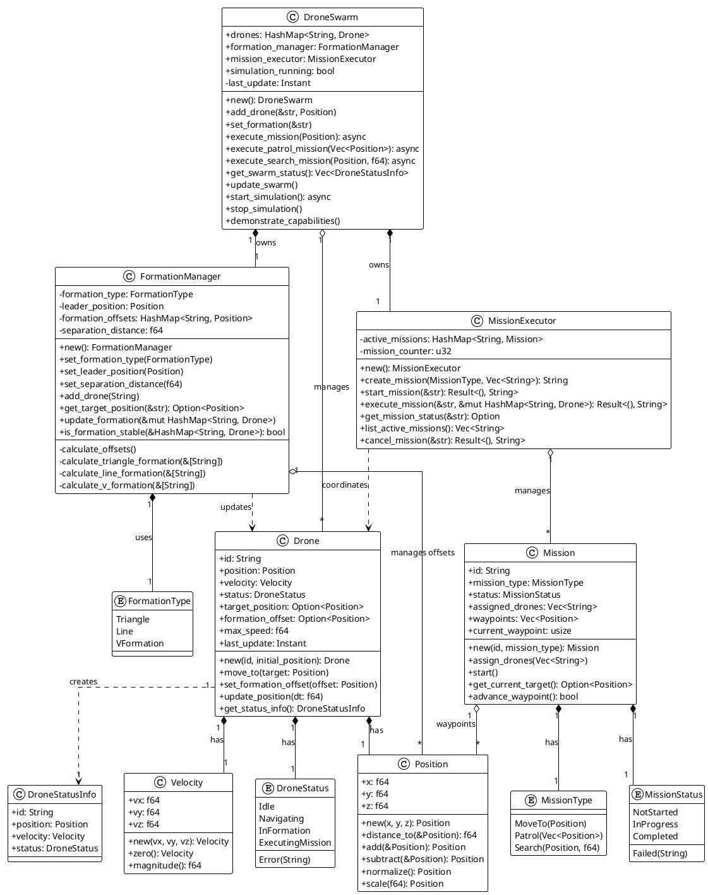
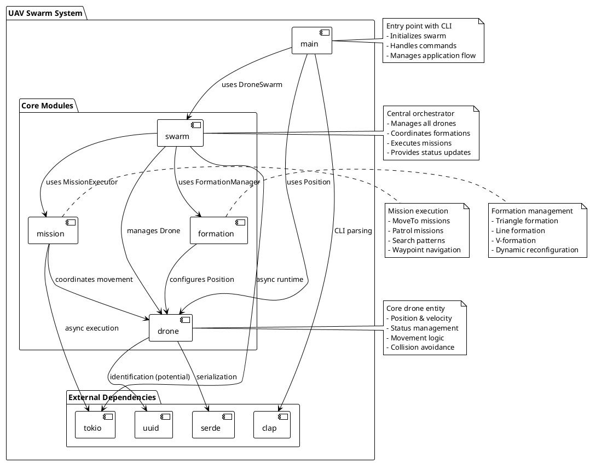
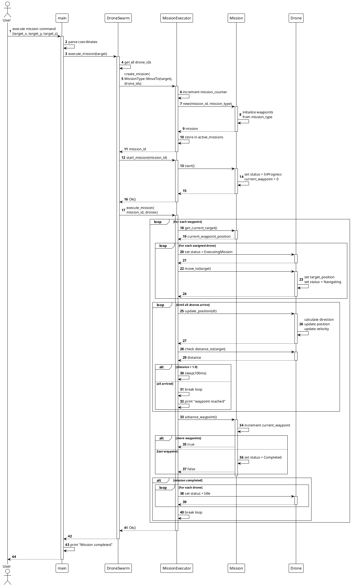
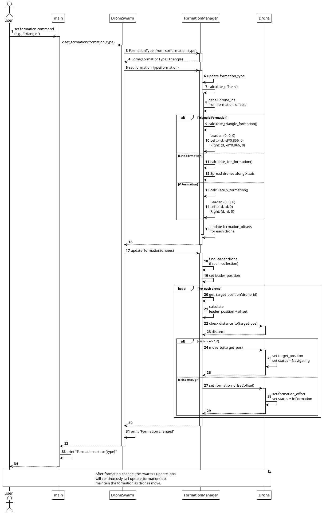
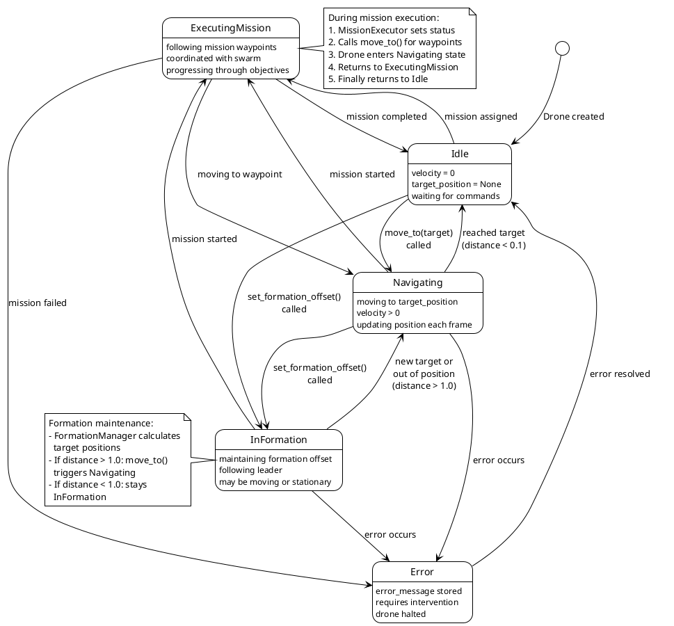
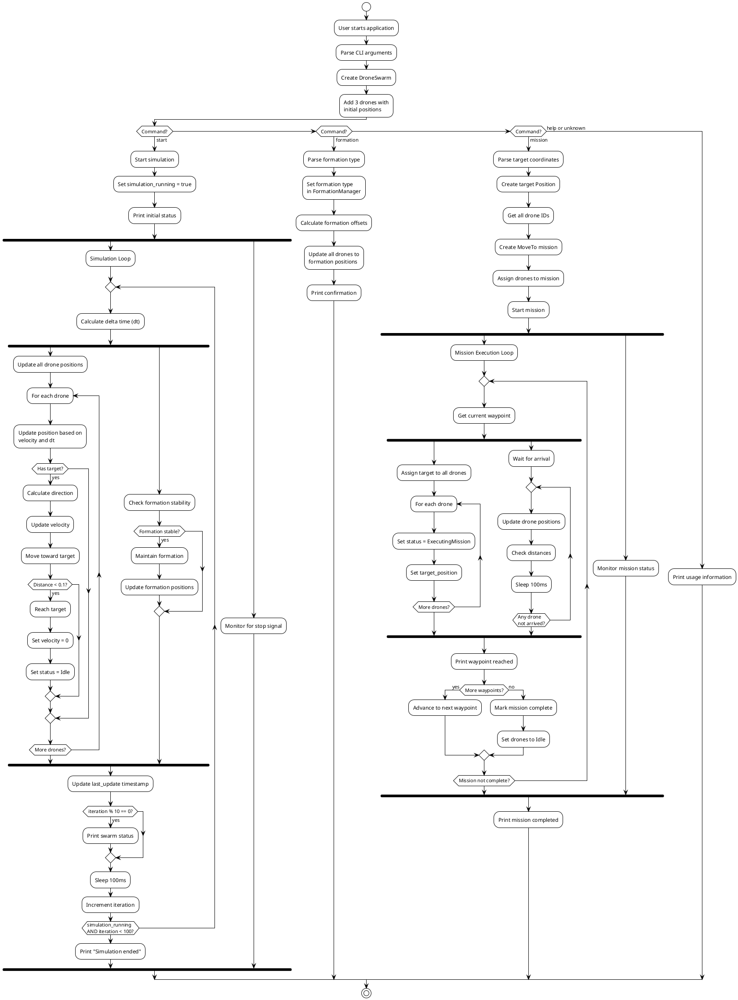

# UAV Swarm System - Architecture Documentation

**Version:** 0.1.0
**Language:** Rust
**Purpose:** Collaborative UAV (Unmanned Aerial Vehicle) Swarm Controller

---

## Table of Contents

1. [System Overview](#system-overview)
2. [Architecture Principles](#architecture-principles)
3. [Class Diagram](#class-diagram)
4. [Module Architecture](#module-architecture)
5. [Behavioral Diagrams](#behavioral-diagrams)
   - [Mission Execution Flow](#mission-execution-flow)
   - [Formation Change Flow](#formation-change-flow)
   - [Drone State Machine](#drone-state-machine)
   - [Simulation Activity](#simulation-activity)
6. [Design Patterns](#design-patterns)
7. [Key Components](#key-components)
8. [Code Navigation](#code-navigation)

---

## System Overview

The UAV Swarm System is a sophisticated drone coordination platform that enables:

- **Multi-Drone Management**: Coordinate multiple autonomous drones simultaneously
- **Formation Control**: Three formation types (Triangle, Line, V-Formation) with dynamic reconfiguration
- **Mission Execution**: Support for MoveTo, Patrol, and Search missions
- **Real-time Navigation**: Continuous position updates and velocity control
- **Status Monitoring**: Real-time tracking of all drone states and positions

### Key Capabilities

- Manages multiple drones with independent position and velocity tracking
- Supports three distinct formation patterns with automatic maintenance
- Executes complex missions with multiple waypoints
- Provides async/await-based execution using Tokio runtime
- CLI interface for easy command and control
- Basic collision avoidance through formation spacing

---

## Architecture Principles

### 1. Separation of Concerns
- **Drone Module**: Core entity with physics and state
- **Formation Module**: Geometric calculations and formation management
- **Mission Module**: Waypoint navigation and mission coordination
- **Swarm Module**: High-level orchestration

### 2. Async/Await Model
- Non-blocking mission execution
- Concurrent drone operations
- Efficient resource utilization with Tokio runtime

### 3. Ownership and Borrowing
- Leverages Rust's ownership system for memory safety
- No garbage collection overhead
- Compile-time guarantees of thread safety

### 4. State Machine Design
- Clear drone state transitions
- Predictable behavior
- Easy debugging and monitoring

---

## Class Diagram

This diagram shows all structs, enums, and their relationships in the system.


<details>
<summary>View PlantUML Source</summary>



</details>

### Key Relationships

- **Composition** (*--): Strong ownership (e.g., Drone owns its Position)
- **Aggregation** (o--): Weak association (e.g., DroneSwarm manages Drones)
- **Dependency** (..>): Uses or creates (e.g., Drone creates DroneStatusInfo)

### Core Structs

#### Position
3D coordinate system with vector operations essential for spatial calculations:
- Distance calculations between positions
- Vector addition/subtraction for relative positioning
- Normalization for direction vectors
- Scaling for movement calculations

#### Drone
Central entity representing each UAV with:
- Current position and velocity
- Target position for navigation
- Formation offset for maintaining formations
- Status tracking (Idle, Navigating, InFormation, ExecutingMission, Error)
- Maximum speed constraint (5.0 m/s)

#### FormationManager
Manages geometric formations:
- Calculates relative positions for each formation type
- Updates drone positions to maintain formation
- Checks formation stability
- Supports dynamic reconfiguration

#### MissionExecutor
Orchestrates mission execution:
- Creates and manages missions
- Coordinates multiple drones
- Handles waypoint progression
- Supports mission cancellation

#### DroneSwarm
Top-level orchestrator that:
- Manages the drone collection
- Owns FormationManager and MissionExecutor
- Provides unified interface for all operations
- Runs simulation loop

---

## Module Architecture

This diagram shows the module structure and dependencies.


<details>
<summary>View PlantUML Source</summary>



</details>

### Module Responsibilities

#### main (src/main.rs)
- CLI argument parsing using `clap`
- Application initialization
- Command routing (start, formation, mission)
- Top-level error handling

#### swarm (src/swarm.rs)
- Central orchestration hub
- Owns and manages drone collection
- Coordinates formations and missions
- Simulation loop implementation
- Status reporting

#### drone (src/drone.rs)
- Core drone entity definition
- Position and velocity structs
- Movement physics calculations
- State management
- Serialization support (serde)

#### formation (src/formation.rs)
- Formation type definitions
- Geometric offset calculations
- Formation stability checking
- Dynamic formation updates

#### mission (src/mission.rs)
- Mission type definitions
- Waypoint management
- Mission execution logic
- Async coordination
- Mission lifecycle management

---

## Behavioral Diagrams

### Mission Execution Flow

This sequence diagram shows how a mission is executed from user command to completion.


<details>
<summary>View PlantUML Source</summary>



</details>

#### Key Steps:

1. **Mission Creation**: User provides target coordinates, system creates MoveTo mission
2. **Drone Assignment**: All available drones assigned to mission
3. **Mission Start**: Status changes to InProgress, waypoint counter initialized
4. **Waypoint Navigation**: For each waypoint:
   - Assign target to all drones
   - Wait for all drones to arrive (distance < 1.0)
   - Advance to next waypoint
5. **Completion**: Mission status set to Completed, drones return to Idle

#### Critical Points:

- **Async Execution**: Uses `tokio::time::sleep` for non-blocking waits
- **Synchronization**: All drones must reach waypoint before advancing
- **Delta Time**: Position updates use elapsed time for physics accuracy
- **Status Tracking**: Clear state transitions (ExecutingMission → Navigating → Idle)

---

### Formation Change Flow

This sequence diagram illustrates how formations are changed and maintained.


<details>
<summary>View PlantUML Source</summary>



</details>

#### Formation Types:

**Triangle Formation**:
```
    Leader (0, 0, 0)
       / \
      /   \
  Left     Right
(-d, -d*0.866, 0)  (d, -d*0.866, 0)
```

**Line Formation**:
```
Drone1 ---- Drone2 ---- Drone3
(-d, 0, 0)  (0, 0, 0)  (d, 0, 0)
```

**V-Formation**:
```
       Leader (0, 0, 0)
      /   \
     /     \
   Left     Right
(-d,-d,0)  (d,-d,0)
```

#### Formation Maintenance:

- **Continuous Updates**: Simulation loop calls `update_formation()` repeatedly
- **Distance Threshold**: Drones navigate if distance > 1.0, else maintain position
- **Leader Tracking**: First drone in collection serves as formation leader
- **Relative Positioning**: All positions calculated relative to leader

---

### Drone State Machine

This state diagram shows all possible drone states and transitions.


<details>
<summary>View PlantUML Source</summary>



</details>

#### State Descriptions:

**Idle**
- Initial state after creation
- Velocity = 0, no target position
- Waiting for commands

**Navigating**
- Moving toward target_position
- Velocity > 0
- Position updated each frame based on delta time
- Automatically transitions to Idle when distance < 0.1

**InFormation**
- Maintaining formation offset from leader
- May be stationary or moving with formation
- Transitions to Navigating if out of position (distance > 1.0)

**ExecutingMission**
- High-level state during mission execution
- Internally uses Navigating state for movement
- Coordinates with other drones in swarm
- Returns to Idle when mission completes

**Error**
- Error condition requiring intervention
- Stores error message
- Drone halted until error resolved

#### Key Transitions:

- **Idle → Navigating**: Direct command to move to position
- **Navigating → Idle**: Automatic when target reached
- **InFormation ↔ Navigating**: Formation maintenance cycle
- **ExecutingMission → Navigating**: Waypoint navigation
- **Any → Error**: Error handling path

---

### Simulation Activity

This activity diagram shows the overall application flow and concurrent activities.


<details>
<summary>View PlantUML Source</summary>



</details>

#### Command Flow:

**Start Command**:
- Initializes simulation loop
- Parallel activities: position updates and formation maintenance
- Prints status every 10 iterations
- 100ms sleep interval between iterations
- Terminates after 100 iterations or manual stop

**Formation Command**:
- Parses formation type (triangle, line, v_formation)
- Calculates geometric offsets
- Updates all drone positions
- Single execution, no loop

**Mission Command**:
- Parses target coordinates
- Creates mission with waypoints
- Parallel activities: drone assignment and arrival monitoring
- Continues until mission complete

#### Concurrency:

- **Fork/Join**: Multiple parallel activities
- **Position Updates**: All drones updated concurrently
- **Formation Maintenance**: Runs alongside position updates
- **Mission Monitoring**: Separate monitoring thread during execution

---

## Design Patterns

### 1. Orchestrator Pattern
**Implementation**: `DroneSwarm`

The DroneSwarm acts as the central orchestrator, coordinating all subsystems:
- Owns the drone collection
- Delegates to FormationManager for formations
- Delegates to MissionExecutor for missions
- Provides unified interface to main

**Benefits**:
- Single point of control
- Clear responsibility boundaries
- Easy to test and maintain

### 2. Strategy Pattern
**Implementation**: `FormationType` enum

Different formation algorithms encapsulated as strategies:
- `Triangle`: Equilateral triangle formation
- `Line`: Linear formation along X-axis
- `VFormation`: V-shaped formation

**Benefits**:
- Easy to add new formations
- Behavior switchable at runtime
- Formations decoupled from drones

### 3. Command Pattern
**Implementation**: `MissionType` enum

Mission types as commands with data:
- `MoveTo(Position)`: Simple point-to-point
- `Patrol(Vec<Position>)`: Multi-waypoint patrol
- `Search(Position, f64)`: Circular search pattern

**Benefits**:
- Missions are first-class objects
- Can be queued, logged, or undone
- Separation of mission definition and execution

### 4. State Pattern
**Implementation**: `DroneStatus` enum

Explicit state machine for drones:
- `Idle`: Waiting for commands
- `Navigating`: Moving to target
- `InFormation`: Maintaining formation
- `ExecutingMission`: Following mission plan
- `Error`: Error condition

**Benefits**:
- Clear state transitions
- Predictable behavior
- Easy to debug

### 5. Builder Pattern (Implicit)
**Implementation**: Mission creation

Missions built incrementally:
```rust
let mut mission = Mission::new(id, mission_type);
mission.assign_drones(drone_ids);
mission.start();
```

### 6. Observer Pattern (Implicit)
**Implementation**: Status monitoring

DroneSwarm observes drone states:
- `get_swarm_status()`: Query all drone states
- Continuous monitoring in simulation loop
- Formation stability checking

---

## Key Components

### Position Struct (src/drone.rs:6-41)

```rust
pub struct Position {
    pub x: f64,
    pub y: f64,
    pub z: f64,
}
```

**Purpose**: 3D coordinate representation with vector operations

**Key Methods**:
- `distance_to(&Position)`: Euclidean distance calculation
- `add/subtract(&Position)`: Vector arithmetic
- `normalize()`: Unit vector for direction
- `scale(f64)`: Scalar multiplication

**Usage**: Foundation for all spatial calculations

### Drone Struct (src/drone.rs:74-147)

```rust
pub struct Drone {
    pub id: String,
    pub position: Position,
    pub velocity: Velocity,
    pub status: DroneStatus,
    pub target_position: Option<Position>,
    pub formation_offset: Option<Position>,
    pub max_speed: f64,
    pub last_update: Instant,
}
```

**Purpose**: Core UAV entity with physics and state

**Key Methods**:
- `move_to(target)`: Set navigation target
- `update_position(dt)`: Physics update with delta time
- `set_formation_offset(offset)`: Enter formation mode
- `get_status_info()`: Create status snapshot

**Physics**:
- Maximum speed: 5.0 m/s
- Arrival threshold: 0.1 distance units
- Velocity calculated from direction and speed
- Position updated each frame: `position += velocity * dt`

### FormationManager (src/formation.rs:22-147)

**Purpose**: Calculate and maintain formation geometries

**Formation Algorithms**:

**Triangle** (separation distance `d`):
```
Leader:    (0, 0, 0)
Left:      (-d, -d*0.866, 0)  // 0.866 ≈ √3/2 for equilateral triangle
Right:     (d, -d*0.866, 0)
```

**Line**:
```
For drone i: ((i-1)*d, 0, 0)
```

**V-Formation**:
```
Leader:    (0, 0, 0)
Left:      (-d, -d, 0)
Right:     (d, -d, 0)
```

**Stability**: Formation considered stable if all drones within 2.0 units of target

### MissionExecutor (src/mission.rs:90-229)

**Purpose**: Execute and coordinate missions

**Mission Lifecycle**:
1. Create: `create_mission(type, drones)` → mission_id
2. Start: `start_mission(id)` → status = InProgress
3. Execute: `execute_mission(id, drones)` → async execution
4. Complete: status = Completed, drones → Idle

**Search Pattern Generation**:
- 8 waypoints in circular pattern
- Distributed evenly around center
- Radius specified by user

### DroneSwarm (src/swarm.rs:7-203)

**Purpose**: Top-level orchestrator

**Main Responsibilities**:
- Drone lifecycle management
- Formation coordination
- Mission delegation
- Simulation loop
- Status reporting

**Simulation Loop**:
1. Calculate delta time
2. Update all drone positions
3. Maintain formation if stable
4. Print status periodically
5. Sleep 100ms
6. Repeat until stopped or 100 iterations

---

## Code Navigation

### File Structure

```
src/
├── main.rs           # Entry point, CLI interface
├── drone.rs          # Core drone entity and physics
├── formation.rs      # Formation management
├── mission.rs        # Mission execution
└── swarm.rs          # Swarm orchestration
```

### Key Locations

**Initialization**:
- `src/main.rs:36-41`: Swarm creation and drone initialization
- `src/drone.rs:86-97`: Drone constructor

**Formation Logic**:
- `src/formation.rs:58-66`: Formation offset calculation dispatcher
- `src/formation.rs:68-80`: Triangle formation algorithm
- `src/formation.rs:82-91`: Line formation algorithm
- `src/formation.rs:93-105`: V-formation algorithm
- `src/formation.rs:113-134`: Formation update and maintenance

**Mission Execution**:
- `src/mission.rs:29-56`: Mission constructor with waypoint generation
- `src/mission.rs:123-211`: Main mission execution loop
- `src/swarm.rs:48-72`: Mission delegation from swarm

**Physics & Movement**:
- `src/drone.rs:109-137`: Position update with delta time
- `src/drone.rs:17-19`: Distance calculation
- `src/drone.rs:29-36`: Vector normalization

**State Management**:
- `src/drone.rs:65-71`: DroneStatus enum
- `src/drone.rs:99-102`: Transition to Navigating state
- `src/drone.rs:104-107`: Transition to InFormation state

**CLI Interface**:
- `src/main.rs:13-34`: Command definitions
- `src/main.rs:43-66`: Command handling

---

## Viewing These Diagrams

### Online
Visit [PlantUML Web Server](http://www.plantuml.com/plantuml/uml/) and paste any PlantUML code block

### VS Code
1. Install "PlantUML" extension
2. Open this file
3. Press `Alt+D` to preview diagrams

### Command Line
```bash
# Install PlantUML
brew install plantuml  # macOS
apt install plantuml   # Ubuntu/Debian

# Generate images from this document
# (requires extracting code blocks)

# Or use the separate .puml files
plantuml doc/*.puml          # Generate PNGs
plantuml -tsvg doc/*.puml    # Generate SVGs
```

### IntelliJ/PyCharm
Built-in PlantUML support - diagrams render automatically

---

## Future Enhancements

Based on the current architecture, potential areas for expansion:

### 1. Enhanced Collision Avoidance
- Implement potential field method
- Add obstacle detection
- Dynamic path planning

### 2. Communication System
- Inter-drone messaging
- Distributed coordination
- Consensus algorithms

### 3. Advanced Path Planning
- A* algorithm for optimal routes
- Obstacle map integration
- Dynamic obstacle avoidance

### 4. Sensor Integration
- Camera feeds
- LIDAR data
- GPS/IMU fusion

### 5. Multi-Swarm Coordination
- Swarm-to-swarm communication
- Hierarchical control
- Task allocation

### 6. More Formation Types
- Diamond formation
- Echelon left/right
- Box formation
- Dynamic formation morphing

### 7. Performance Optimizations
- Spatial partitioning (quadtree/octree)
- Parallel drone updates
- GPU acceleration for physics

### 8. Extended Mission Types
- Area coverage missions
- Target tracking
- Cooperative transport
- Surveillance patterns

---

## Conclusion

The UAV Swarm System demonstrates a clean, modular architecture built on solid design patterns. The separation of concerns between drone physics, formation management, and mission execution enables flexible composition and easy extension.

Key strengths:
- Clear module boundaries
- Type-safe state management with Rust enums
- Async/await for non-blocking operations
- Geometric precision with floating-point calculations
- Scalable orchestration pattern

The architecture provides a solid foundation for building more sophisticated autonomous swarm behaviors while maintaining code clarity and maintainability.

---

**Document Version**: 1.0
**Last Updated**: 2025-12-21
**Maintainer**: Development Team
