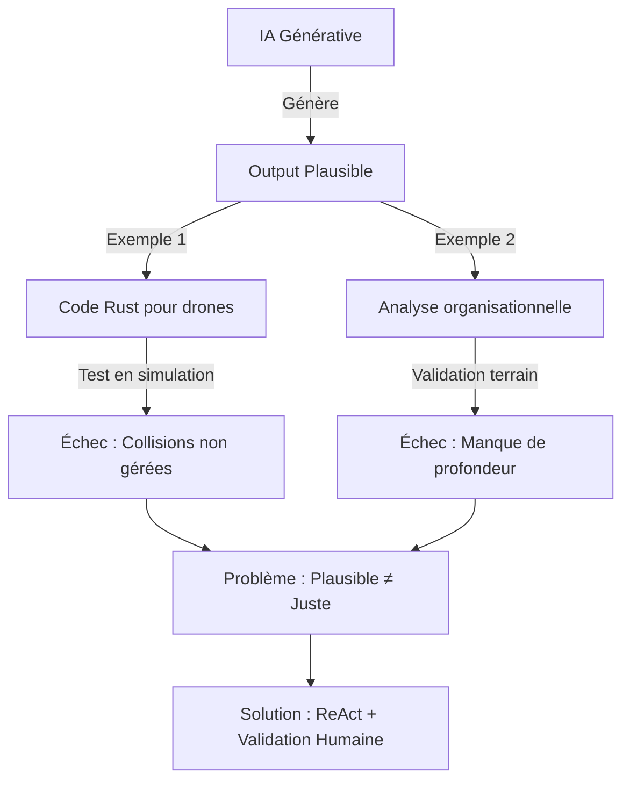
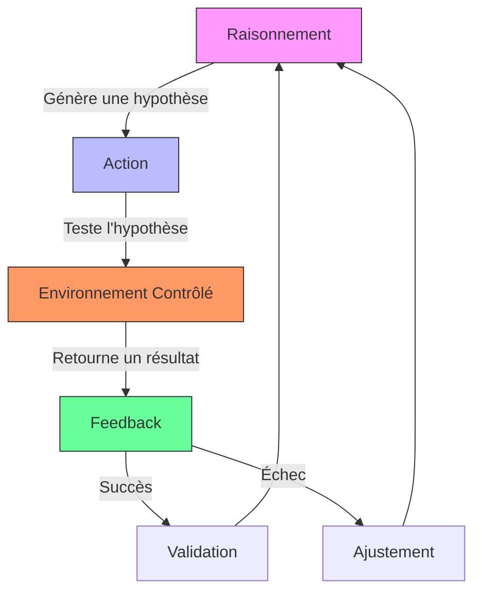
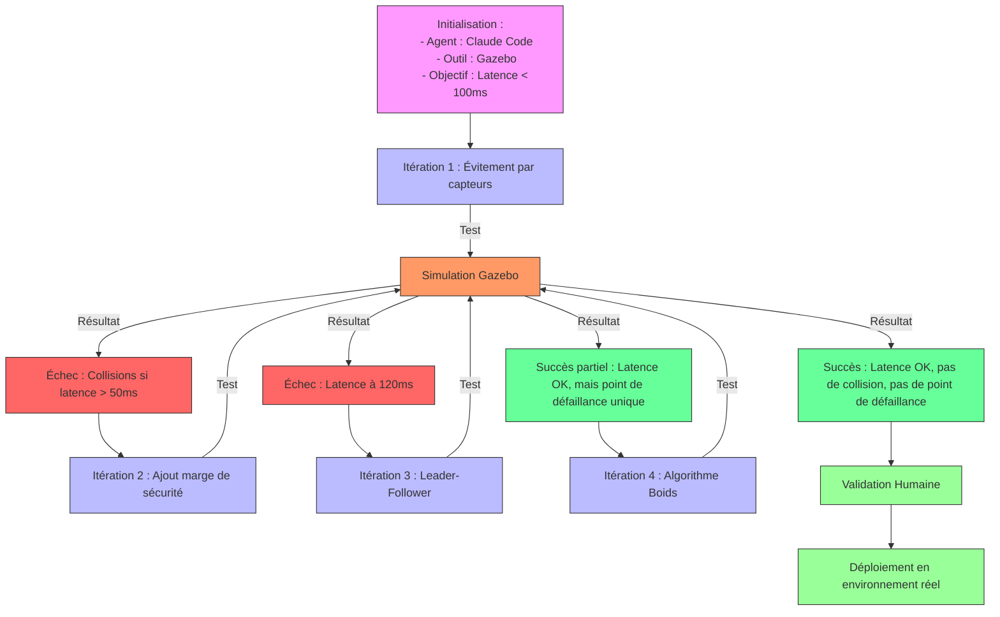
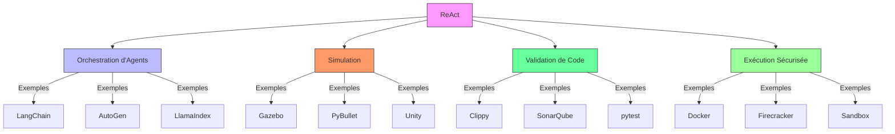
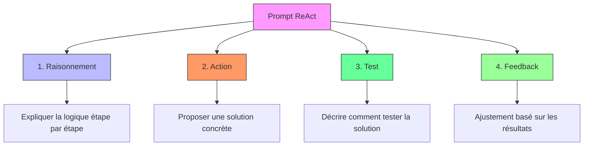
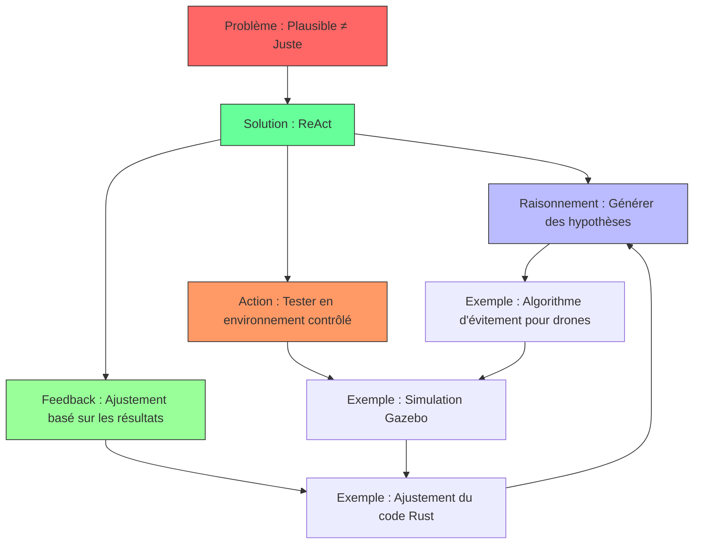

# **Synthèse Complète : ReAct, l'IA et la Confrontation au Terrain**
*Comment transformer le plausible en juste grâce aux boucles de raisonnement et d'action*

---

## **📌 Introduction et Contexte**

### **Origine de la Discussion**
Xavier Warzee (Xavier Orga) a partagé une exploration personnelle sur l'utilisation de l'IA générative pour gérer un **essaim de drones autonomes**, un projet complexe impliquant :
- **Ingénierie système**
- **Logiciel temps réel en Rust**
- **Robotique simulée**
- **Tests et DevOps**

L'objectif était de répondre à la question : **"Jusqu’où une seule personne peut-elle aller, sur un système complexe, en s’appuyant sérieusement sur l’IA générative ?"**

**Trois convictions clés en sont ressorties :**
1. L’IA abaisse les frontières entre disciplines, **sans les supprimer**.
2. Les **vraies décisions restent humaines** : l’IA instruit, l’ingénieur tranche.
3. La **valeur se déplace** : produire devient bon marché, mais **spécifier, intégrer et vérifier deviennent rares**.

---

## **🔍 Le Problème Fondamental : Plausible vs. Juste**

### **Pourquoi l’IA Générative Échoue-t-elle ?**
L’IA, notamment les grands modèles de langage (LLMs), excelle à produire du **plausible** : des réponses cohérentes en apparence, alignées sur des patterns statistiques, mais **pas toujours justes ou ajustées au contexte réel**.

**Exemples concrets :**
- Un agent IA peut générer un **code Rust pour gérer un essaim de drones** qui *semble* correct (syntaxe, structure), mais qui **échoue en simulation** à cause de contraintes non prises en compte (latence, collisions, etc.).
- Une **analyse organisationnelle** peut *sonner* juste, mais manquer de profondeur ou de validation terrain.

**→ Problème central :**
> *Comment **valider et ajuster** les outputs de l’IA pour qu’ils deviennent **fiables et adaptés** ?*



---

## **🛠️ Le Pattern ReAct : Définition et Principes**

### **Qu’est-ce que ReAct ?**
**ReAct** (*Reasoning and Acting*) est un **pattern d’interaction** pour les agents IA qui combine :
1. **Raisonnement (Reasoning)** : L’agent génère des hypothèses, des plans ou des solutions en **explicitant sa logique** (via des *traces* ou *chain-of-thought*).
2. **Action (Acting)** : L’agent **teste ses hypothèses** dans un environnement contrôlé (simulation, exécution de code, appels à des outils externes).
3. **Feedback** : L’agent **reçoit des résultats concrets** (succès, échec, données terrain) et **ajuste son raisonnement** en conséquence.

**→ Boucle vertueuse :**
```
Raisonnement → Action → Feedback → Nouveau Raisonnement → ...
```



### **Pourquoi ReAct est-il efficace ?**

| **Avantage**               | **Explication**                                                                 | **Exemple**                                                                                     |
|----------------------------|---------------------------------------------------------------------------------|-------------------------------------------------------------------------------------------------|
| **Validation par les faits** | Les propositions de l’IA sont **testées en conditions réelles** (simulation, tests). | Un algorithme de gestion de drones est validé via Gazebo avant déploiement.                     |
| **Transparence**           | Le raisonnement de l’IA est **explicite**, ce qui permet de suivre sa logique.   | L’agent explique pourquoi il a choisi un algorithme de consensus distribué plutôt qu’un autre. |
| **Itération rapide**      | Les erreurs sont **détectées tôt** et corrigées en boucle.                     | Si un test échoue, l’agent ajuste son code et relance une simulation.                          |
| **Réduction des biais**    | Les *hallucinations* ou *plausibles mais faux* sont **filtrés** par les tests.   | Un code généré est vérifié avec Clippy (Rust) ou pytest (Python).                              |

---

## **🚀 Application de ReAct à ton Projet : Essaim de Drones**

### **Cas d’usage : Gestion de collision pour 10 drones autonomes**
**Objectif :** Implémenter un système robuste en Rust, avec une latence < 100ms.



### **Détail des Itérations**

#### **Étape 1 : Initialisation**
- **Agent** : Claude Code (génération de code) + Gazebo (simulation).
- **Prompt** : *"Comment implémenter un système de gestion de collision pour 10 drones autonomes en Rust, avec une latence < 100ms ?"*

#### **Étape 2 : Première Itération ReAct**
1. **Raisonnement** :
   - "Un essaim de drones nécessite un protocole de communication décentralisé."
   - "Option 1 : Algorithme basé sur des règles locales (évitement par capteurs) → Simple et rapide."
   - "Option 2 : Consensus distribué (ex : Paxos) → Robuste mais complexe."
   - **Choix** : Tester l’option 1 en premier.

2. **Action** :
   Génération du code Rust pour l’évitement par capteurs.
   ```rust
   fn avoid_collision(drone: &Drone, others: &[Drone]) -> Vector3 {
       let mut direction = Vector3::zero();
       for other in others {
           if drone.position.distance_to(&other.position) < SAFE_DISTANCE {
               direction += (drone.position - other.position).normalize();
           }
       }
       direction
   }
   ```

3. **Feedback** :
   **Test en simulation (Gazebo)** : "Échec : 2 drones entrent en collision si leurs capteurs ont une latence > 50ms."

#### **Étape 3 : Deuxième Itération ReAct**
1. **Raisonnement** : Le problème vient de la latence des capteurs. Il faut ajouter une marge de sécurité ou changer d’algorithme.
2. **Action** : Modification du code pour ajouter une marge de 20% sur la distance de sécurité.
3. **Feedback** : "Succès : Plus de collision, mais la latence moyenne passe à 120ms (dépassement du seuil)."

#### **Étape 4 : Troisième Itération ReAct**
1. **Raisonnement** : La marge de sécurité augmente la latence. Essayons un algorithme de consensus distribué (leader-follower).
2. **Action** : Implémentation d’un leader-follower en Rust.
3. **Feedback** : "Succès : Latence < 100ms, mais le leader est un point de défaillance unique."

#### **Étape 5 : Quatrième Itération ReAct**
1. **Raisonnement** : Il faut un algorithme sans leader. Essayons un modèle inspiré des Boids (swarm intelligence).
2. **Action** : Implémentation d’un algorithme de type Boids.
3. **Feedback** : "Succès : Latence < 100ms, pas de collision, pas de point de défaillance unique. Par contre, la consommation CPU est élevée."

#### **Étape 6 : Validation Humaine**
- **Toi (l’ingénieur)** :
  - Valides que la solution répond aux contraintes (latence, robustesse, consommation CPU).
  - Décides d’optimiser la consommation CPU en ajustant les paramètres des Boids.
  - **Déploie en environnement réel** pour des tests supplémentaires.

---

## **🔧 Outils pour Implémenter ReAct**



| **Catégorie**               | **Outils**                          | **Rôle**                                                                 | **Lien**                                  |
|----------------------------|-------------------------------------|--------------------------------------------------------------------------|-------------------------------------------|
| **Orchestration d’agents** | LangChain, AutoGen, LlamaIndex       | Gérer les boucles ReAct et les outils externes.                        | [langchain.ai](https://www.langchain.com/) |
| **Simulation**             | Gazebo, PyBullet, Unity              | Tester des algorithmes de drones/robotique.                            | [gazebosim.org](https://gazebosim.org/)     |
| **Validation de code**     | Clippy (Rust), SonarQube, pytest     | Détecter des erreurs avant exécution.                                  | [clippy.rs](https://github.com/rust-lang/rust-clippy) |
| **Exécution sécurisée**   | Docker, Firecracker, Sandbox         | Isoler l’exécution du code généré.                                     | [docker.com](https://www.docker.com/)     |
| **ReAct pour le code**     | SWE-agent, GitHub Copilot            | Générer et tester du code en boucle.                                   | [SWE-agent](https://github.com/princeton-nlp/SWE-agent) |

---

## **⚖️ ReAct vs. Autres Patterns**

```mermaid
%% Diagramme : Comparaison des patterns pour agents IA
flowchart TD
    A[Patterns pour Agents IA] --> B[ReAct]
    A --> C[Chain-of-Thought]
    A --> D[Chain-of-Verification]
    A --> E[Self-Refinement]
    
    B -->|Avantages| F[✅ Validation par les faits]
    B -->|Inconvénients| G[❌ Nécessite un environnement de test]
    B -->|Cas d'usage| H[🎯 Projets complexes : robotique, ingénierie système]
    
    C -->|Avantages| I[✅ Améliore la qualité des raisonnements]
    C -->|Inconvénients| J[❌ Pas de validation externe]
    C -->|Cas d'usage| K[🎯 Problèmes de raisonnement pur : maths, logique]
    
    D -->|Avantages| L[✅ Vérification multi-méthodes]
    D -->|Inconvénients| M[❌ Plus lent]
    D -->|Cas d'usage| N[🎯 Solutions critiques : sécurité, conformité]
    
    E -->|Avantages| O[✅ L'agent s'améliore seul]
    E -->|Inconvénients| P[❌ Risque de boucles infinies]
    E -->|Cas d'usage| Q[🎯 Optimisation itérative : code, designs]
    
    style A fill:#f9f,stroke:#333
    style B fill:#bbf,stroke:#333
    style C fill:#f96,stroke:#333
    style D fill:#6f9,stroke:#333
    style E fill:#9f9,stroke:#333
```



| **Pattern**               | **Avantages**                          | **Inconvénients**                     | **Quand l’utiliser ?**                     |
|---------------------------|----------------------------------------|---------------------------------------|-------------------------------------------|
| **ReAct**                 | Boucle raisonnement/action, validation par des faits. | Nécessite un environnement de test. | **Projets complexes** (robotique, ingénierie système). |
| **Chain-of-Thought (CoT)** | Améliore la qualité des raisonnements. | Pas de validation externe.            | **Problèmes de raisonnement pur** (maths, logique). |
| **Chain-of-Verification (CoV)** | Vérification multi-méthodes. | Plus lent.                            | **Solutions critiques** (sécurité, conformité). |
| **Self-Refinement**       | L’agent s’améliore seul.               | Risque de boucles infinies.           | **Optimisation itérative** (code, designs). |

---

## **💡 Bonnes Pratiques pour Utiliser ReAct**

### **1. Structurer les Prompts**
Utilise des **prompts ReAct** pour guider l’agent :
```
Tu es un ingénieur système expert en robotique et Rust.
Pour chaque problème, suis ce processus :
1. [RAISONNEMENT] : Explique ta logique étape par étape.
2. [ACTION] : Propose une solution concrète (code, algorithme, architecture).
3. [TEST] : Décris comment tester cette solution (simulation, tests unitaires, etc.).
4. [FEEDBACK] : Attends les résultats des tests, puis ajuste ton raisonnement.

Problème : "Comment implémenter un système de gestion de collision pour 10 drones autonomes en Rust, avec une latence < 100ms ?"
```



### **2. Automatiser les Boucles**
- Utilise **LangChain** ou **AutoGen** pour chaîner les actions (génération → test → analyse).
- Exemple avec LangChain :
  ```python
  from langchain.agents import AgentExecutor, Tool
  from langchain.tools import BaseTool

  class SimulationTool(BaseTool):
      name = "run_simulation"
      description = "Lance une simulation de drones avec le code généré."

      def _run(self, code: str) -> str:
          result = gazebo_simulator.run(code)
          return f"Résultat de la simulation : {result}"

  tools = [SimulationTool()]
  agent = AgentExecutor.from_agent_and_tools(agent=ZeroShotAgent(...), tools=tools)
  agent.run("Implémente un algorithme de gestion de collision pour 10 drones en Rust.")
  ```

### **3. Documenter les Itérations**
- Garde une trace de chaque boucle ReAct (raisonnement → action → feedback) pour :
  - Comprendre les erreurs.
  - Améliorer les prompts.
  - Partager avec l’équipe.

### **4. Ajouter des Garde-fous**
- **Analyse statique** : Clippy (Rust), SonarQube.
- **Tests formels** : TLA+, Alloy.
- **Sandboxing** : Docker, Firecracker.

---

## **📚 Ressources pour Aller Plus Loin**

### **Papers**
- [ReAct: Synergizing Reasoning and Acting in Language Models](https://arxiv.org/abs/2210.03629) (Yao et al., 2022) → **Le paper fondateur de ReAct**. 
- [AgentVerse: Facilitating Multi-Agent Collaboration](https://arxiv.org/abs/2308.10848) (Microsoft) → **ReAct dans un cadre multi-agents**. 
- [SWE-agent: Agent for Software Engineering](https://arxiv.org/abs/2308.08226) → **ReAct appliqué au développement logiciel**. 

### **Outils Pratiques**
- [LangChain + ReAct](https://python.langchain.com/docs/modules/agents/agent_types/react) → **Tutoriel officiel pour implémenter ReAct**. 
- [AutoGen + ReAct](https://microsoft.github.io/autogen/docs/Use-Cases/agent_chain) → **Exemples avec multi-agents**. 
- [SWE-agent](https://github.com/princeton-nlp/SWE-agent) → **ReAct pour résoudre des issues GitHub**. 

### **Exemples Concrets**
- [ReAct pour le débogage de code](https://github.com/ysymyth/ReAct) → **Démonstration avec des bugs Python**. 
- [ReAct + Simulation](https://github.com/joonspk-research/autoagent) → **Intégration avec des environnements simulés**. 

---

## **🎯 Synthèse des Échanges avec Xavier**

### **1. Le Problème de Base**
- L’IA génère du **plausible**, pas du **juste**.
- **Exemple** : Un code ou une analyse peut *paraître* correct(e) mais échouer en pratique (ex : collisions de drones, erreurs factuelles).

### **2. La Solution : ReAct**
- **ReAct = Raisonnement + Action + Feedback**.
- **Application** : L’agent propose une solution, la teste en simulation, et ajuste son raisonnement.



### **3. Cas Pratique : Essaim de Drones**
- **Itération 1** : Algorithme d’évitement par capteurs → **Échec** (collisions dues à la latence).
- **Itération 2** : Ajout d’une marge de sécurité → **Échec** (latence trop élevée).
- **Itération 3** : Algorithme leader-follower → **Succès partiel** (latence OK, mais point de défaillance unique).
- **Itération 4** : Algorithme inspiré des Boids → **Succès** (latence OK, pas de collision, pas de point de défaillance).
- **Validation humaine** : Ajustement final et déploiement.

### **4. Outils Clés Utilisés**
- **Orchestration** : LangChain, AutoGen.
- **Simulation** : Gazebo, PyBullet.
- **Validation** : Clippy, pytest, SonarQube.

### **5. Limites et Compléments**
- ReAct seul ne suffit pas pour des systèmes critiques.
- **Ajouter** :
  - Des **garde-fous** (analyse statique, tests formels).
  - Des **boucles humaines** (validation manuelle, feedback explicite).
  - D’autres **patterns** (Chain-of-Verification, Self-Refinement).

---

## **🚀 Prochaines Étapes pour Toi, Xavier**

1. **Tester ReAct sur un sous-problème** : Commence par un algorithme simple (ex : évitement de base pour 2 drones).
2. **Intégrer un outil de simulation** : Gazebo ou PyBullet pour valider tes solutions.
3. **Documenter tes itérations** : Pour comprendre ce qui marche (et ce qui ne marche pas).
4. **Partager tes retours** : Rejoins des communautés comme [Discord LangChain](https://discord.gg/langchain) pour échanger.

---

## **💬 Questions Ouvertes**
- As-tu déjà **testé ReAct** (même informellement) dans ton projet drones ?
- Quels **outils de simulation/validation** utilises-tu actuellement ?
- Quel **premier cas d’usage** te semblerait le plus pertinent pour commencer avec ReAct ?
- Comment gères-tu le **risque de 
