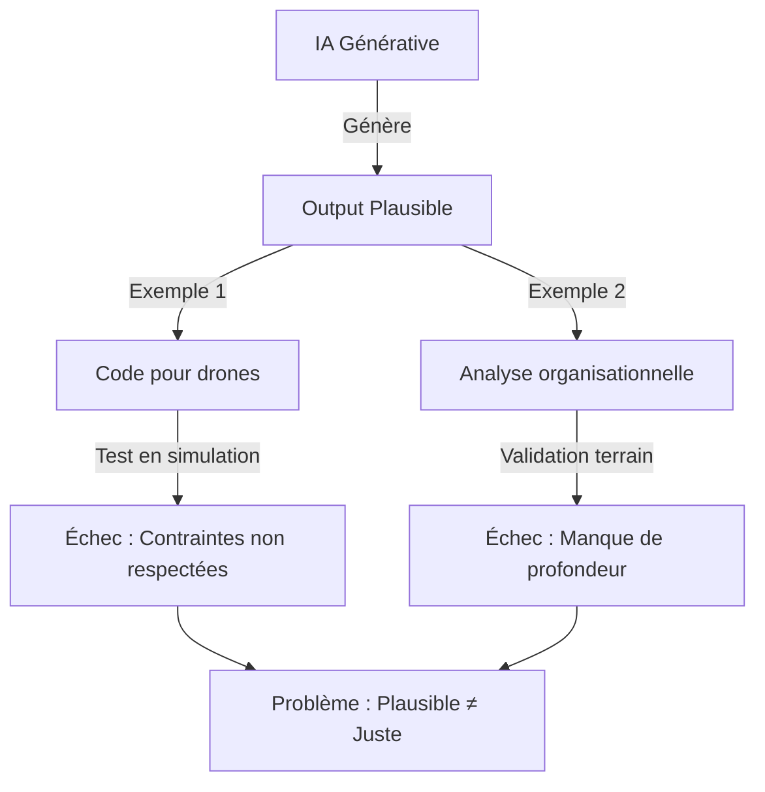
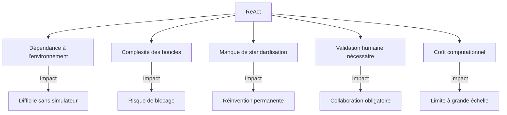
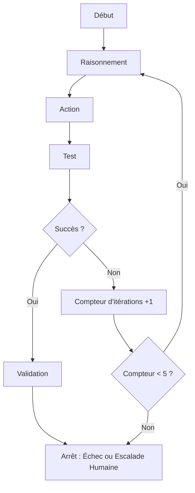
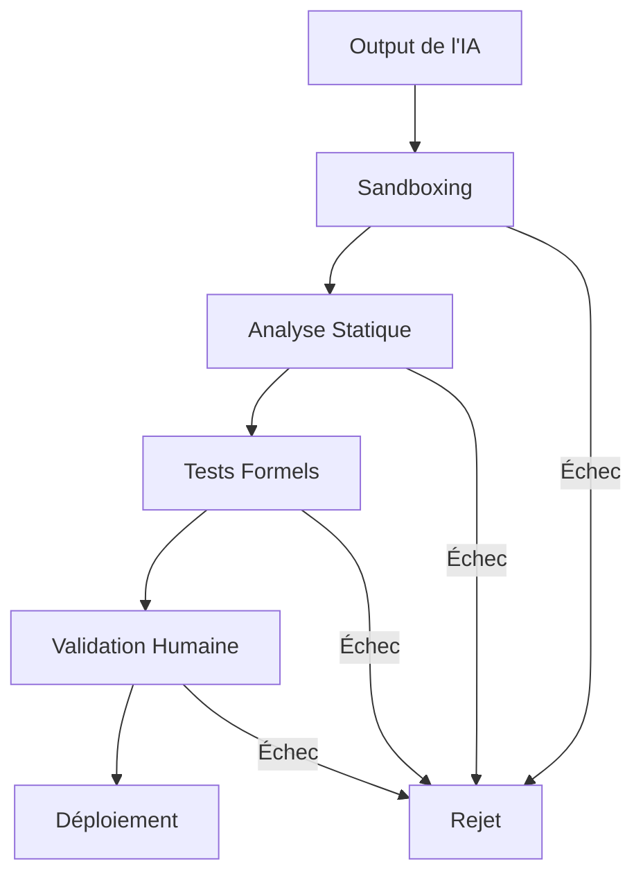

# **Document de Réflexion : Amélioration de la Démarche ReAct pour les Agents IA**
*Comment structurer une approche progressive pour transformer le plausible en juste*

---

## **📌 Introduction**

### **Contexte et Objectifs**
L’utilisation de l’IA générative pour résoudre des problèmes complexes (comme la gestion d’un essaim de drones autonomes) soulève un défi majeur : **comment valider et ajuster les outputs de l’IA pour qu’ils deviennent fiables et adaptés au contexte réel ?**

L’IA excelle à produire du **plausible** (des réponses cohérentes en apparence), mais échoue souvent à générer du **juste** (des solutions exactes et ajustées aux contraintes réelles). Le pattern **ReAct** (*Reasoning and Acting*) offre une réponse partielle en combinant **raisonnement, action et feedback** pour confronter les propositions de l’IA à la réalité.

Ce document propose une **réflexion structurée** pour améliorer la démarche ReAct, en identifiant :
1. Les **limites actuelles** de l’approche.
2. Les **axes d’amélioration** prioritaires.
3. Un **backlog progressif** de sujets à explorer, classés par intérêt et faisabilité.

---

## **🔍 Analyse des Limites Actuelles**

### **1. Le Problème du "Plausible vs. Juste"**



**Problèmes identifiés :**
- **Manque de validation systématique** : Les outputs de l’IA ne sont pas toujours confrontés à des **tests concrets** (simulations, données terrain).
- **Dépendance au contexte** : L’IA ne capture pas les **contraintes implicites** (ex : latence, sécurité, culture organisationnelle).
- **Risque de "hallucinations"** : L’IA peut inventer des références, des données ou des solutions non valides.
- **Complexité des systèmes** : Les projets multi-disciplinaires (ex : robotique + IA + DevOps) nécessitent une **orchestration fine** entre les outils et les acteurs.

---

### **2. Limites de ReAct**

Bien que ReAct soit une avancée majeure, il présente des **limites** :

| **Limite**                          | **Explication**                                                                                     | **Impact**                                                                                     |
|-------------------------------------|-----------------------------------------------------------------------------------------------------|------------------------------------------------------------------------------------------------|
| **Dépendance à l’environnement**     | ReAct nécessite un **environnement de test contrôlé** (ex : simulateur, sandbox).                     | Difficile à appliquer dans des contextes où les tests sont coûteux ou complexes.               |
| **Complexité des boucles**          | Les boucles ReAct peuvent devenir **trop longues** ou **trop complexes** à gérer.                     | Risque de perte de performance ou de blocage.                                                |
| **Manque de standardisation**       | Il n’existe pas de **méthodologie universelle** pour appliquer ReAct.                              | Chaque projet doit réinventer sa propre approche.                                           |
| **Validation humaine nécessaire**  | ReAct ne remplace pas l’expertise humaine pour les **décisions critiques**.                      | Nécessite une **collaboration étroite** entre l’IA et les humains.                           |
| **Coût computationnel**             | Les simulations et tests répétés peuvent être **gourmands en ressources**.                       | Limite l’applicabilité à grande échelle.                                                   |



---

## **🎯 Axes d’Amélioration**

Pour rendre ReAct plus efficace, voici **5 axes d’amélioration** prioritaires :

### **1. Automatiser la Validation**
**Objectif** : Réduire la dépendance aux validations manuelles en **automatisant les tests et les feedbacks**.

**Pistes :**
- Intégrer des **outils de validation automatique** (ex : linters, tests unitaires, analyse statique).
- Utiliser des **simulateurs légers** (ex : PyBullet pour la robotique, QEMU pour les systèmes embarqués).
- Développer des **métriques de confiance** pour évaluer la fiabilité des outputs de l’IA.

**Exemple :**
```python
# Exemple de validation automatique avec pytest
import pytest

def test_collision_avoidance():
    drones = [Drone(position=(i, i, 0)) for i in range(10)]
    for drone in drones:
        new_direction = avoid_collision(drone, drones)
        assert not will_collide(drone, new_direction, drones), "Collision détectée !"
```

---

### **2. Structurer les Boucles ReAct**
**Objectif** : Éviter les boucles infinies ou trop complexes en **définissant des règles claires** pour l’arrêt ou l’ajustement.

**Pistes :**
- **Limiter le nombre d’itérations** (ex : max 5 boucles par problème).
- **Définir des critères d’arrêt** (ex : succès du test, échec répété, coût trop élevé).
- **Prioriser les actions** en fonction de leur impact potentiel.



---

### **3. Standardiser les Méthodologies**
**Objectif** : Créer des **bonnes pratiques universelles** pour appliquer ReAct dans différents contextes.

**Pistes :**
- Développer des **templates de prompts ReAct** pour des cas d’usage courants (ex : développement logiciel, analyse de données).
- Créer des **librairies d’outils ReAct** (ex : connecteurs pour Gazebo, Docker, SonarQube).
- Documenter des **études de cas** (ex : gestion de drones, optimisation de workflows DevOps).

---

### **4. Intégrer des Garde-fous**
**Objectif** : Limiter les risques liés aux outputs incorrects de l’IA.

**Pistes :**
- **Sandboxing** : Exécuter le code généré dans des environnements isolés (ex : Docker, Firecracker).
- **Analyse statique** : Utiliser des outils comme **Clippy** (Rust) ou **SonarQube** pour détecter des erreurs avant exécution.
- **Tests formels** : Appliquer des méthodes de vérification formelle (ex : TLA+, Alloy) pour les systèmes critiques.



---

### **5. Optimiser les Coûts**
**Objectif** : Réduire le coût computationnel des boucles ReAct.

**Pistes :**
- **Cache des résultats** : Éviter de relancer des tests identiques.
- **Paralléliser les tests** : Utiliser des outils comme **Ray** ou **Dask** pour accélérer les simulations.
- **Simplifier les environnements** : Utiliser des simulateurs légers ou des modèles réduits pour les premières itérations.

---

## **📋 Backlog Progressif de Sujets à Explorer**

### **🔹 Niveau 1 : Fondamentaux (Priorité Élevée, Faisabilité Immédiate)**
*Sujets simples à implémenter, avec un impact direct sur la fiabilité de ReAct.*

| **ID** | **Sujet**                                      | **Description**                                                                                     | **Intérêt** | **Complexité** | **Dépendances** |
|--------|------------------------------------------------|-----------------------------------------------------------------------------------------------------|-------------|----------------|------------------|
| 1.1    | **Templates de prompts ReAct**                 | Créer des templates de prompts pour des cas d’usage courants (ex : développement, analyse).       | ⭐⭐⭐⭐⭐ | ⭐             | Aucune           |
| 1.2    | **Intégration de linters**                     | Automatiser la validation de code avec Clippy, ESLint, etc.                                      | ⭐⭐⭐⭐⭐ | ⭐             | Outils existants |
| 1.3    | **Sandboxing avec Docker**                     | Exécuter le code généré dans des conteneurs Docker pour isoler les risques.                     | ⭐⭐⭐⭐  | ⭐⭐            | Docker           |
| 1.4    | **Tests unitaires automatiques**              | Générer et exécuter des tests unitaires pour valider le code généré.                             | ⭐⭐⭐⭐⭐ | ⭐⭐            | pytest, JUnit    |
| 1.5    | **Documentation des itérations**              | Structurer un système de logging pour suivre les boucles ReAct.                                  | ⭐⭐⭐⭐  | ⭐             | Aucune           |

---

### **🔹 Niveau 2 : Améliorations (Priorité Moyenne, Faisabilité Court Terme)**
*Sujets nécessitant un effort modéré, avec un impact significatif sur l’efficacité de ReAct.*

| **ID** | **Sujet**                                      | **Description**                                                                                     | **Intérêt** | **Complexité** | **Dépendances** |
|--------|------------------------------------------------|-----------------------------------------------------------------------------------------------------|-------------|----------------|------------------|
| 2.1    | **Connecteurs pour simulateurs**              | Développer des connecteurs pour Gazebo, PyBullet, etc.                                            | ⭐⭐⭐⭐  | ⭐⭐⭐          | Simulateurs      |
| 2.2    | **Métriques de confiance**                     | Définir des métriques pour évaluer la fiabilité des outputs de l’IA.                              | ⭐⭐⭐⭐⭐ | ⭐⭐⭐          | Données terrain   |
| 2.3    | **Gestion des boucles ReAct**                  | Implémenter des règles pour limiter le nombre d’itérations et éviter les blocages.               | ⭐⭐⭐⭐  | ⭐⭐⭐          | Aucune           |
| 2.4    | **Cache des résultats de test**               | Stocker les résultats de tests pour éviter les redondances.                                        | ⭐⭐⭐    | ⭐⭐            | Redis, Memcached |
| 2.5    | **Parallélisation des tests**                 | Utiliser Ray ou Dask pour accélérer les simulations.                                              | ⭐⭐⭐⭐  | ⭐⭐⭐          | Ray, Dask        |

---

### **🔹 Niveau 3 : Avancé (Priorité Long Terme, Faisabilité Complexe)**
*Sujets ambitieux, nécessitant des ressources importantes, mais avec un potentiel transformateur.*

| **ID** | **Sujet**                                      | **Description**                                                                                     | **Intérêt** | **Complexité** | **Dépendances** |
|--------|------------------------------------------------|-----------------------------------------------------------------------------------------------------|-------------|----------------|------------------|
| 3.1    | **Standardisation de ReAct**                   | Créer une méthodologie universelle pour appliquer ReAct dans différents contextes.              | ⭐⭐⭐⭐⭐ | ⭐⭐⭐⭐⭐       | Communauté       |
| 3.2    | **Intégration avec des outils de CI/CD**       | Automatiser ReAct dans des pipelines GitHub Actions, Jenkins, etc.                                  | ⭐⭐⭐⭐⭐ | ⭐⭐⭐⭐        | CI/CD           |
| 3.3    | **Validation formelle**                        | Appliquer des méthodes de vérification formelle (TLA+, Alloy) pour les systèmes critiques.       | ⭐⭐⭐⭐  | ⭐⭐⭐⭐⭐       | Expertise       |
| 3.4    | **Multi-agents ReAct**                         | Étendre ReAct à des équipes d’agents collaborants (ex : un agent pour le code, un pour les tests). | ⭐⭐⭐⭐⭐ | ⭐⭐⭐⭐        | AutoGen         |
| 3.5    | **Optimisation des coûts computationnels**    | Réduire le coût des simulations via des modèles réduits ou des approximations.                  | ⭐⭐⭐⭐  | ⭐⭐⭐⭐        | Recherche       |

---

### **🔹 Niveau 4 : Exploration (Priorité Faible, Faisabilité Incertaine)**
*Sujets innovants ou expérimentaux, à explorer pour anticiper les évolutions futures.*

| **ID** | **Sujet**                                      | **Description**                                                                                     | **Intérêt** | **Complexité** | **Dépendances** |
|--------|------------------------------------------------|-----------------------------------------------------------------------------------------------------|-------------|----------------|------------------|
| 4.1    | **ReAct avec IA spécialisée**                  | Utiliser des modèles d’IA spécialisés (ex : pour la robotique, la cybersécurité) dans les boucles ReAct. | ⭐⭐⭐    | ⭐⭐⭐⭐⭐       | Modèles IA      |
| 4.2    | **ReAct en temps réel**                        | Adapter ReAct pour des systèmes temps réel (ex : drones, voitures autonomes).                     | ⭐⭐⭐⭐  | ⭐⭐⭐⭐⭐       | Matériel         |
| 4.3    | **ReAct avec feedback humain en temps réel**  | Intégrer des boucles de feedback humain en temps réel (ex : via des interfaces collaboratives). | ⭐⭐⭐⭐  | ⭐⭐⭐⭐⭐       | Interfaces      |
| 4.4    | **ReAct pour la prise de décision**            | Étendre ReAct à des processus de prise de décision complexes (ex : gestion de crise).              | ⭐⭐⭐    | ⭐⭐⭐⭐⭐       | Expertise       |
| 4.5    | **ReAct avec apprentissage continu**          | Permettre à l’agent d’apprendre de ses erreurs pour améliorer ses futures itérations.             | ⭐⭐⭐⭐  | ⭐⭐⭐⭐⭐       | Recherche       |

---

## **📊 Roadmap Proposée**

### **Phase 1 : Fondamentaux (0-3 mois)**
**Objectif** : Mettre en place les bases pour une utilisation fiable de ReAct.

- **Implémenter** :
  - [1.1] Templates de prompts ReAct.
  - [1.2] Intégration de linters (Clippy, ESLint).
  - [1.3] Sandboxing avec Docker.
  - [1.4] Tests unitaires automatiques.
  - [1.5] Documentation des itérations.

**Résultat attendu** : Une **première version fonctionnelle** de ReAct, applicable à des projets simples.

---

### **Phase 2 : Améliorations (3-6 mois)**
**Objectif** : Optimiser l’efficacité et la robustesse de ReAct.

- **Implémenter** :
  - [2.1] Connecteurs pour simulateurs (Gazebo, PyBullet).
  - [2.2] Métriques de confiance.
  - [2.3] Gestion des boucles ReAct.
  - [2.4] Cache des résultats de test.
  - [2.5] Parallélisation des tests.

**Résultat attendu** : Une **version optimisée** de ReAct, applicable à des projets complexes.

---

### **Phase 3 : Avancé (6-12 mois)**
**Objectif** : Étendre ReAct à des cas d’usage critiques et collaboratifs.

- **Implémenter** :
  - [3.1] Standardisation de ReAct.
  - [3.2] Intégration avec des outils de CI/CD.
  - [3.3] Validation formelle (TLA+, Alloy).
  - [3.4] Multi-agents ReAct.
  - [3.5] Optimisation des coûts computationnels.

**Résultat attendu** : Une **version mature** de ReAct, adaptée aux systèmes critiques.

---

### **Phase 4 : Exploration (12+ mois)**
**Objectif** : Explorer des pistes innovantes pour anticiper les évolutions futures.

- **Explorer** :
  - [4.1] ReAct avec IA spécialisée.
  - [4.2] ReAct en temps réel.
  - [4.3] ReAct avec feedback humain en temps réel.
  - [4.4] ReAct pour la prise de décision.
  - [4.5] ReAct avec apprentissage continu.

**Résultat attendu** : Des **pistes pour les prochaines générations** de ReAct.

---

## **📌 Recommandations Clés**

### **1. Commencer Petit, Itérer Rapidement**
- **Prioriser les sujets de Niveau 1** (fondamentaux) pour obtenir des résultats rapides.
- **Documenter chaque itération** pour capitaliser sur les apprentissages.

### **2. Collaborer avec les Communautés**
- Rejoindre des communautés comme **LangChain**, **AutoGen**, ou **SWE-agent** pour partager des bonnes pratiques.
- Contribuer à des projets open source liés à ReAct.

### **3. Mesurer l’Impact**
- **Définir des métriques** pour évaluer l’efficacité de ReAct (ex : réduction des erreurs, gain de temps).
- **Recueillir des feedbacks** des utilisateurs pour ajuster la démarche.

### **4. Anticiper les Évolutions**
- **Suivre les avancées** en IA générative et en orchestration d’agents.
- **Explorer les sujets de Niveau 4** pour rester à la pointe de l’innovation.

---

## **🔚 Conclusion**

ReAct est une **avancée majeure** pour rendre les agents IA plus fiables et adaptés aux contraintes réelles. Cependant, son **potentiel pleinement exploité** nécessite :
1. Une **standardisation** des méthodologies.
2. Une **automatisation** des validations et des tests.
3. Une **collaboration étroite** entre l’IA et les humains.
4. Une **optimisation continue** des coûts et des performances.

Ce document propose un **cadre structuré** pour améliorer ReAct de manière progressive, en tenant compte des **contraintes réelles** (coût, complexité, faisabilité). Le **backlog** permet de prioriser les efforts en fonction de leur **intérêt et de leur complexité**, tout en garantissant une **amélioration continue** de la démarche.

---

*Document de réflexion - Juin 2026*
