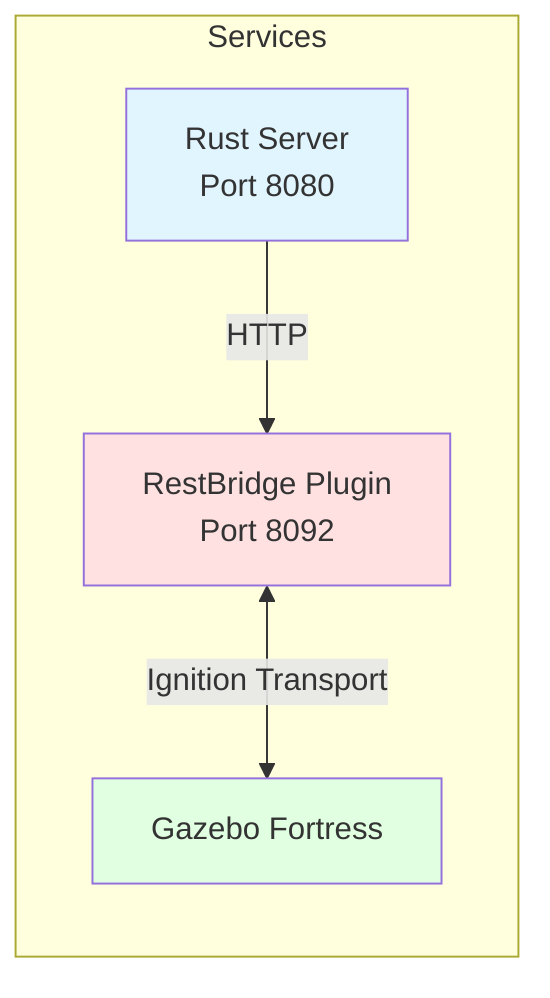
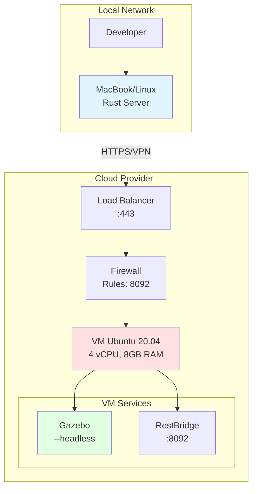
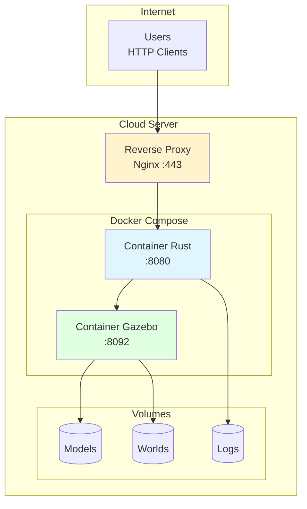

# UAV Swarm - Deployment Guide

Technical guide for system administrators

---

## Table of Contents

1. [Overview](#overview)
2. [Deployment - Scenario 1: Local Rust + Remote Gazebo](#deployment-scenario-1)
3. [Deployment - Scenario 2: Unified Server](#deployment-scenario-2)
4. [Network and Security Configuration](#network-and-security-configuration)
5. [Monitoring and Logs](#monitoring-and-logs)
6. [Maintenance](#maintenance)

---

## Overview

### Components and Ports



| Component | Port | Protocol | Exposure |
|-----------|------|----------|----------|
| Rust API | 8080 | HTTP/WebSocket | Public |
| RestBridge Plugin | 8092 | HTTP | Internal/VPN |
| Ignition Transport | - | UDP/TCP | Localhost only |

---

## Deployment Scenario 1

**Local Rust + Remote Gazebo**

### Infrastructure Diagram



### Step 1: Provisioning the Remote Server

#### Infrastructure as Code (Terraform)

```hcl
# main.tf
resource "aws_instance" "gazebo_server" {
  ami           = "ami-0c55b159cbfafe1f0"  # Ubuntu 20.04
  instance_type = "t3.xlarge"

  vpc_security_group_ids = [aws_security_group.gazebo_sg.id]

  tags = {
    Name = "uav-gazebo-server"
  }
}

resource "aws_security_group" "gazebo_sg" {
  name = "gazebo-security-group"

  ingress {
    from_port   = 22
    to_port     = 22
    protocol    = "tcp"
    cidr_blocks = ["YOUR_IP/32"]  # SSH
  }

  ingress {
    from_port   = 8092
    to_port     = 8092
    protocol    = "tcp"
    cidr_blocks = ["YOUR_IP/32"]  # RestBridge
  }

  egress {
    from_port   = 0
    to_port     = 0
    protocol    = "-1"
    cidr_blocks = ["0.0.0.0/0"]
  }
}
```

### Step 2: Installation on Remote Server

```bash
#!/bin/bash
# deploy/install_gazebo_server.sh

set -e

# System update
sudo apt update && sudo apt upgrade -y

# Install Ignition Gazebo Fortress
sudo apt install -y software-properties-common
sudo sh -c 'echo "deb http://packages.osrfoundation.org/gazebo/ubuntu-stable $(lsb_release -cs) main" > /etc/apt/sources.list.d/gazebo-stable.list'
wget https://packages.osrfoundation.org/gazebo.key -O - | sudo apt-key add -
sudo apt update
sudo apt install -y ignition-fortress

# Build dependencies
sudo apt install -y cmake g++ git \
  libignition-gazebo7-dev \
  libignition-transport12-dev \
  libignition-math7-dev

# Clone project
cd /home/ubuntu
git clone https://github.com/your-org/uav_in_rust.git gazebo
cd gazebo

# Build plugin
cd gazebo/plugins/rest_bridge
mkdir build && cd build
cmake ..
make -j$(nproc)

echo "Installation complete!"
echo "Plugin: $(pwd)/lib/libRestBridgePlugin.so"
```

### Step 3: Configuration

**On remote server** (`/home/ubuntu/gazebo/.env`):
```bash
export IGN_GAZEBO_RESOURCE_PATH="/home/ubuntu/gazebo/models"
export IGN_GAZEBO_SYSTEM_PLUGIN_PATH="/home/ubuntu/gazebo/plugins/rest_bridge/build/lib"
```

**On local machine** (`config/simulation.toml`):
```toml
[gazebo]
bridge_url = "http://137.74.119.34:8092"
enabled = true
timeout_ms = 15000
```

### Step 4: Startup with systemd (Remote Server)

Create `/etc/systemd/system/gazebo-sim.service`:
```ini
[Unit]
Description=Gazebo UAV Simulation
After=network.target

[Service]
Type=simple
User=ubuntu
WorkingDirectory=/home/ubuntu/gazebo
Environment="IGN_GAZEBO_RESOURCE_PATH=/home/ubuntu/gazebo/models"
Environment="IGN_GAZEBO_SYSTEM_PLUGIN_PATH=/home/ubuntu/gazebo/plugins/rest_bridge/build/lib"
ExecStart=/home/ubuntu/gazebo/launch/start_simulation.sh --headless
Restart=always
RestartSec=10

[Install]
WantedBy=multi-user.target
```

Enable and start:
```bash
sudo systemctl daemon-reload
sudo systemctl enable gazebo-sim
sudo systemctl start gazebo-sim
sudo systemctl status gazebo-sim
```

### Step 5: Remote Monitoring

**Health check script** (`deploy/health_check.sh`):
```bash
#!/bin/bash
GAZEBO_URL="http://137.74.119.34:8092"

response=$(curl -s -o /dev/null -w "%{http_code}" "$GAZEBO_URL/health")

if [ "$response" = "200" ]; then
  echo "✓ Gazebo server OK"
  exit 0
else
  echo "✗ Gazebo server DOWN (HTTP $response)"
  exit 1
fi
```

Add to crontab:
```bash
*/5 * * * * /home/ubuntu/gazebo/deploy/health_check.sh >> /var/log/gazebo-health.log 2>&1
```

---

## Deployment Scenario 2

**Unified Server (Rust + Gazebo)**

### Infrastructure Diagram



### Docker Compose

Create `deploy/docker-compose.yml`:
```yaml
version: '3.8'

services:
  gazebo:
    image: osrf/ros:galactic-desktop
    container_name: uav-gazebo
    command: >
      bash -c "
      apt-get update &&
      apt-get install -y ignition-fortress &&
      cd /gazebo &&
      ./launch/start_simulation.sh --headless
      "
    volumes:
      - ./gazebo:/gazebo
      - gazebo-logs:/var/log/gazebo
    environment:
      - IGN_GAZEBO_RESOURCE_PATH=/gazebo/models
      - IGN_GAZEBO_SYSTEM_PLUGIN_PATH=/gazebo/plugins/rest_bridge/build/lib
    networks:
      - uav-network
    ports:
      - "8092:8092"
    restart: unless-stopped

  rust-api:
    build:
      context: .
      dockerfile: deploy/Dockerfile
    container_name: uav-rust-api
    command: ./target/release/uav_swarm --mode gazebo serve --host 0.0.0.0
    volumes:
      - ./config:/app/config
      - rust-logs:/app/logs
    environment:
      - RUST_LOG=info
      - UAV_GAZEBO_BRIDGE_URL=http://gazebo:8092
    networks:
      - uav-network
    ports:
      - "8080:8080"
    depends_on:
      - gazebo
    restart: unless-stopped

  nginx:
    image: nginx:alpine
    container_name: uav-nginx
    volumes:
      - ./deploy/nginx.conf:/etc/nginx/nginx.conf:ro
      - ./deploy/ssl:/etc/nginx/ssl:ro
    ports:
      - "80:80"
      - "443:443"
    depends_on:
      - rust-api
    networks:
      - uav-network
    restart: unless-stopped

networks:
  uav-network:
    driver: bridge

volumes:
  gazebo-logs:
  rust-logs:
```

### Dockerfile for Rust

Create `deploy/Dockerfile`:
```dockerfile
FROM rust:1.70 as builder

WORKDIR /build
COPY . .

RUN cargo build --release

FROM debian:bullseye-slim

RUN apt-get update && apt-get install -y \
    ca-certificates \
    libssl1.1 \
    && rm -rf /var/lib/apt/lists/*

WORKDIR /app

COPY --from=builder /build/target/release/uav_swarm .
COPY --from=builder /build/config ./config

EXPOSE 8080

CMD ["./uav_swarm", "serve", "--host", "0.0.0.0"]
```

### Nginx Configuration

Create `deploy/nginx.conf`:
```nginx
events {
    worker_connections 1024;
}

http {
    upstream rust_backend {
        server rust-api:8080;
    }

    server {
        listen 80;
        server_name your-domain.com;
        return 301 https://$server_name$request_uri;
    }

    server {
        listen 443 ssl http2;
        server_name your-domain.com;

        ssl_certificate /etc/nginx/ssl/cert.pem;
        ssl_certificate_key /etc/nginx/ssl/key.pem;

        location / {
            proxy_pass http://rust_backend;
            proxy_http_version 1.1;
            proxy_set_header Upgrade $http_upgrade;
            proxy_set_header Connection "upgrade";
            proxy_set_header Host $host;
            proxy_set_header X-Real-IP $remote_addr;
            proxy_set_header X-Forwarded-For $proxy_add_x_forwarded_for;
            proxy_set_header X-Forwarded-Proto $scheme;
        }

        location /api/ws {
            proxy_pass http://rust_backend;
            proxy_http_version 1.1;
            proxy_set_header Upgrade $http_upgrade;
            proxy_set_header Connection "upgrade";
        }
    }
}
```

### Deployment

```bash
# 1. Clone project on server
git clone https://github.com/your-org/uav_in_rust.git
cd uav_in_rust

# 2. Configure
cp config/simulation.toml.example config/simulation.toml
vim config/simulation.toml  # bridge_url = "http://gazebo:8092"

# 3. Generate SSL certificates (Let's Encrypt)
sudo apt install certbot
sudo certbot certonly --standalone -d your-domain.com
sudo cp /etc/letsencrypt/live/your-domain.com/fullchain.pem deploy/ssl/cert.pem
sudo cp /etc/letsencrypt/live/your-domain.com/privkey.pem deploy/ssl/key.pem

# 4. Start
docker-compose -f deploy/docker-compose.yml up -d

# 5. Verify
docker-compose -f deploy/docker-compose.yml ps
curl https://your-domain.com/api/simulation/status
```

---

## Network and Security Configuration

### Firewall (ufw)

```bash
# Allow SSH
sudo ufw allow 22/tcp

# Allow HTTP/HTTPS (if unified server)
sudo ufw allow 80/tcp
sudo ufw allow 443/tcp

# Allow RestBridge (only from specific IPs)
sudo ufw allow from YOUR_IP to any port 8092 proto tcp

# Enable
sudo ufw enable
sudo ufw status verbose
```

### iptables Rules (Alternative)

```bash
#!/bin/bash
# deploy/firewall.sh

# Reset
iptables -F
iptables -X
iptables -P INPUT DROP
iptables -P FORWARD DROP
iptables -P OUTPUT ACCEPT

# Loopback
iptables -A INPUT -i lo -j ACCEPT

# Established connections
iptables -A INPUT -m conntrack --ctstate ESTABLISHED,RELATED -j ACCEPT

# SSH
iptables -A INPUT -p tcp --dport 22 -j ACCEPT

# HTTP/HTTPS
iptables -A INPUT -p tcp --dport 80 -j ACCEPT
iptables -A INPUT -p tcp --dport 443 -j ACCEPT

# RestBridge (only from specific IP)
iptables -A INPUT -p tcp -s YOUR_IP --dport 8092 -j ACCEPT

# Save
iptables-save > /etc/iptables/rules.v4
```

### VPN (Optional but Recommended)

**WireGuard to Secure Rust ↔ Gazebo**

On Gazebo server:
```bash
sudo apt install wireguard

# Generate keys
wg genkey | tee privatekey | wg pubkey > publickey

# /etc/wireguard/wg0.conf
[Interface]
Address = 10.0.0.1/24
ListenPort = 51820
PrivateKey = <SERVER_PRIVATE_KEY>

[Peer]
PublicKey = <CLIENT_PUBLIC_KEY>
AllowedIPs = 10.0.0.2/32

# Start
sudo wg-quick up wg0
sudo systemctl enable wg-quick@wg0
```

On local machine:
```bash
# /etc/wireguard/wg0.conf
[Interface]
Address = 10.0.0.2/24
PrivateKey = <CLIENT_PRIVATE_KEY>

[Peer]
PublicKey = <SERVER_PUBLIC_KEY>
Endpoint = 137.74.119.34:51820
AllowedIPs = 10.0.0.1/32
PersistentKeepalive = 25

# Start
sudo wg-quick up wg0

# Test
ping 10.0.0.1
```

Then modify `config/simulation.toml`:
```toml
[gazebo]
bridge_url = "http://10.0.0.1:8092"  # VPN IP
```

---

## Monitoring and Logs

### Prometheus + Grafana

**Export Metrics from Rust**

Add to `Cargo.toml`:
```toml
[dependencies]
prometheus = "0.13"
actix-web-prometheus = "0.1"
```

Expose metrics:
```rust
// src/api/server.rs
use actix_web_prometheus::PrometheusMetricsBuilder;

let prometheus = PrometheusMetricsBuilder::new("api")
    .endpoint("/metrics")
    .build()
    .unwrap();

HttpServer::new(move || {
    App::new()
        .wrap(prometheus.clone())
        // ... other routes
})
```

**Prometheus Configuration** (`deploy/prometheus.yml`):
```yaml
global:
  scrape_interval: 15s

scrape_configs:
  - job_name: 'uav-rust-api'
    static_configs:
      - targets: ['rust-api:8080']

  - job_name: 'node-exporter'
    static_configs:
      - targets: ['node-exporter:9100']
```

### Centralized Logs

**ELK Stack** (`deploy/docker-compose-monitoring.yml`):
```yaml
version: '3.8'

services:
  elasticsearch:
    image: docker.elastic.co/elasticsearch/elasticsearch:8.5.0
    environment:
      - discovery.type=single-node
    volumes:
      - es-data:/usr/share/elasticsearch/data

  logstash:
    image: docker.elastic.co/logstash/logstash:8.5.0
    volumes:
      - ./deploy/logstash.conf:/usr/share/logstash/pipeline/logstash.conf
    depends_on:
      - elasticsearch

  kibana:
    image: docker.elastic.co/kibana/kibana:8.5.0
    ports:
      - "5601:5601"
    depends_on:
      - elasticsearch

volumes:
  es-data:
```

### Alerting (Alertmanager)

Configure alerts for:
- Gazebo service down
- HTTP latency > 1s
- Rust ↔ Gazebo connection errors
- CPU/Memory > 80%

---

## Maintenance

### Backup

```bash
#!/bin/bash
# deploy/backup.sh

BACKUP_DIR="/backup/uav_swarm"
DATE=$(date +%Y%m%d_%H%M%S)

# Backup configuration
tar -czf "$BACKUP_DIR/config_$DATE.tar.gz" config/

# Backup logs
tar -czf "$BACKUP_DIR/logs_$DATE.tar.gz" logs/

# Backup custom models
tar -czf "$BACKUP_DIR/models_$DATE.tar.gz" gazebo/models/

# Clean backups older than 30 days
find "$BACKUP_DIR" -name "*.tar.gz" -mtime +30 -delete
```

### Update

```bash
#!/bin/bash
# deploy/update.sh

set -e

echo "=== UAV Swarm Update ==="

# 1. Stop services
docker-compose -f deploy/docker-compose.yml down

# 2. Backup
./deploy/backup.sh

# 3. Pull latest
git pull origin main

# 4. Rebuild
docker-compose -f deploy/docker-compose.yml build

# 5. Restart
docker-compose -f deploy/docker-compose.yml up -d

# 6. Verify
sleep 10
curl -f http://localhost:8080/api/simulation/status || exit 1

echo "✓ Update complete"
```

### Rolling Updates (Zero-downtime)

For unified scenario with multiple instances:

```yaml
# deploy/docker-compose-ha.yml
services:
  rust-api:
    deploy:
      replicas: 3
      update_config:
        parallelism: 1
        delay: 10s
      restart_policy:
        condition: on-failure
```

---

## Deployment Checklist

### Pre-deployment

- [ ] Server provisioned (CPU: 4 cores, RAM: 8GB min)
- [ ] Ubuntu 20.04+ installed
- [ ] SSH access configured
- [ ] Firewall configured
- [ ] DNS/hostname configured
- [ ] SSL certificates obtained

### Installation

- [ ] Ignition Gazebo installed
- [ ] RestBridge plugin compiled
- [ ] Rust dependencies installed
- [ ] Docker + Docker Compose installed (if applicable)

### Configuration

- [ ] `config/simulation.toml` configured
- [ ] Environment variables defined
- [ ] World files copied
- [ ] Models copied

### Testing

- [ ] Gazebo health check: `curl http://IP:8092/health`
- [ ] Rust health check: `curl http://IP:8080/health`
- [ ] End-to-end test: `./test_simulation_api.sh`
- [ ] Load test: `ab -n 1000 -c 10 http://IP:8080/api/simulation/status`

### Production

- [ ] Services enabled at startup (systemd)
- [ ] Monitoring configured
- [ ] Centralized logs
- [ ] Alerting configured
- [ ] Automatic backup configured
- [ ] Documentation up to date

---

**Support Contact**: devops@your-org.com
