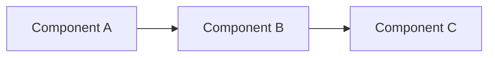

# UAV Swarm Documentation

Official documentation for the UAV Swarm project - Drone Swarm Control System

---

## 📚 Available Documents

### For Users

- **[USER_GUIDE.md](USER_GUIDE.md)** - Complete user guide
  - Introduction and concepts
  - System architecture with UML diagrams
  - Two illustrated deployment scenarios
  - Installation and configuration instructions
  - REST API usage guide
  - Common troubleshooting

### For System Administrators

- **[DEPLOYMENT_GUIDE.md](DEPLOYMENT_GUIDE.md)** - Technical deployment guide
  - Infrastructure as Code (Terraform)
  - Docker/Docker Compose deployment
  - Network and security configuration (firewall, VPN)
  - Monitoring (Prometheus, Grafana, ELK)
  - Maintenance scripts and backup procedures
  - Production deployment checklist

---

## 🎯 Covered Deployment Scenarios

### Scenario 1: Distributed Development
- **Rust Server**: On your local machine (development)
- **Gazebo Server**: On remote server (simulation)
- **Use case**: Local testing with cloud simulation

### Scenario 2: Unified Deployment
- **Rust + Gazebo**: On same remote server
- **Use case**: Production, minimal latency

---

## 📊 Included Diagrams

The guides contain **Mermaid** diagrams for:

- Global system architecture
- UML class diagrams
- Sequence diagrams
- Infrastructure diagrams
- Deployment diagrams
- State diagrams

💡 **Tip**: Visualize Mermaid diagrams in:
- GitHub (automatic rendering)
- VSCode with "Markdown Preview Mermaid Support" extension
- [Mermaid Live Editor](https://mermaid.live/)

---

## 🚀 Quick Start

### Local Installation

```bash
# Clone project
git clone https://github.com/your-org/uav_in_rust.git
cd uav_in_rust

# Read documentation
cat doc/man/USER_GUIDE.md

# Run in local mode (without Gazebo)
cargo run -- --mode internal serve
```

### Server Deployment

```bash
# On server
./deploy/install_gazebo_server.sh
./deploy/start_all.sh

# Test
curl http://localhost:8080/api/simulation/status
```

---

## 📖 Recommended Reading Order

1. **New users**:
   - Start with [USER_GUIDE.md](USER_GUIDE.md) sections 1-3
   - Test locally with `internal` mode
   - Move to sections 4-7 to use Gazebo

2. **Production deployment**:
   - Read [USER_GUIDE.md](USER_GUIDE.md) to understand architecture
   - Follow [DEPLOYMENT_GUIDE.md](DEPLOYMENT_GUIDE.md) step by step
   - Configure monitoring

3. **Developers**:
   - Architecture in [USER_GUIDE.md](USER_GUIDE.md) section 2
   - Source code in `src/`
   - API documentation: `http://localhost:8080/swagger-ui/`

---

## 🔧 Quick Configuration

### Main file: `config/simulation.toml`

```toml
[simulation]
mode = "gazebo"  # or "internal"
update_rate_hz = 10.0

[gazebo]
# Choose according to your scenario:
# Local:   bridge_url = "http://localhost:8092"
# Remote:  bridge_url = "http://137.74.119.34:8092"
# Docker:  bridge_url = "http://gazebo:8092"
bridge_url = "http://gazebo_server:8092"

enabled = true
timeout_ms = 15000
```

---

## 🆘 Support

- **GitHub Issues**: To report bugs or request features
- **Discussions**: For general questions
- **Email**: support@your-org.com

---

## 📄 PDF Generation

All documentation can be generated as PDF files for offline reading or printing.

### Quick Start

```bash
cd doc/man
./generate_pdf.sh
```

Generated PDFs will be in: `doc/man/pdf/`

### Features

- ✅ Automatic Mermaid diagram conversion
- ✅ Table of contents with hyperlinks
- ✅ Syntax highlighting for code blocks
- ✅ Professional formatting
- ✅ Jenkins automation support

### Options

```bash
./generate_pdf.sh                    # Generate all PDFs
./generate_pdf.sh USER_GUIDE.md      # Generate specific PDF
./generate_pdf.sh --clean            # Clean generated files
```

For detailed instructions, see [PDF_GENERATION.md](PDF_GENERATION.md)

---

## 📝 Contributing to Documentation

Contributions are welcome! To improve this documentation:

1. Fork the project
2. Create a branch: `git checkout -b doc/improvement-xxx`
3. Modify files in `doc/man/`
4. Test Mermaid diagram rendering
5. Submit a Pull Request

### Diagram Format

We use **Mermaid** for all diagrams. Example:



---

## 📅 Version History

- **v1.0.0** (February 2026)
  - Initial documentation
  - Two deployment scenarios
  - Complete user and admin guides

---

## 📄 License

Documentation under [MIT](../../LICENSE) license - Free to use and modify
