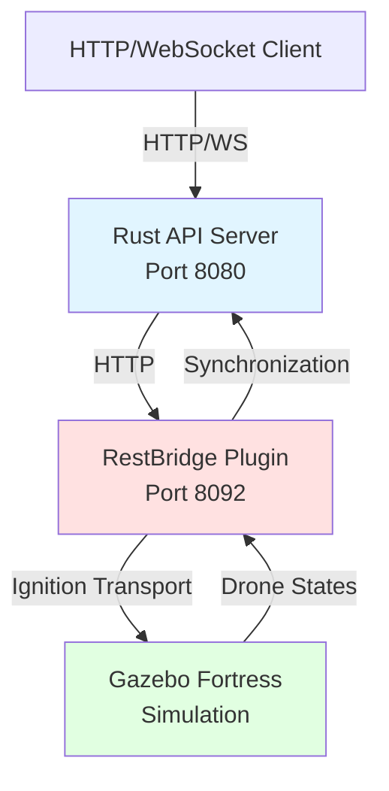
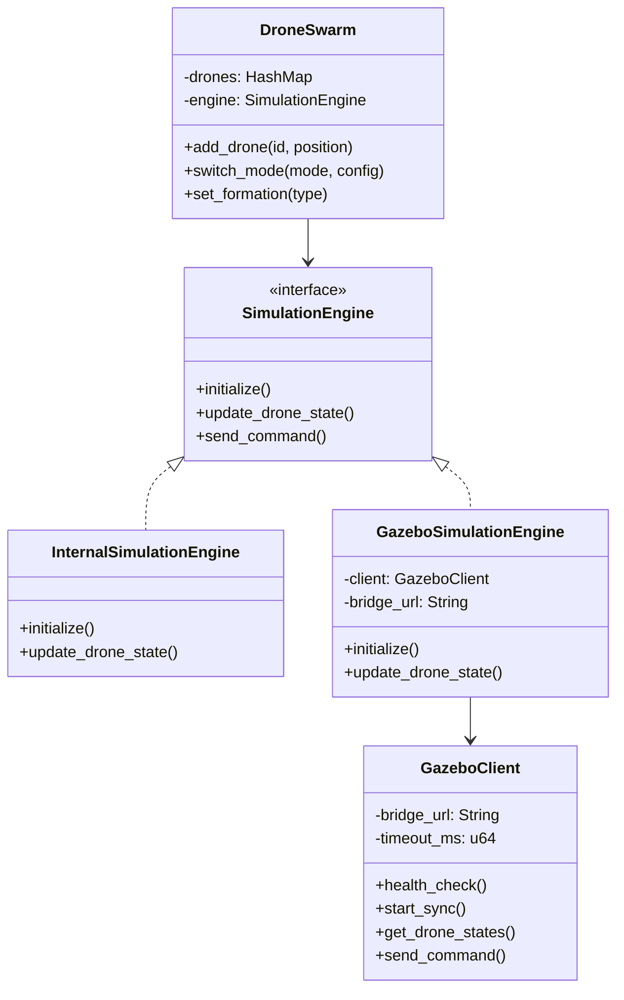
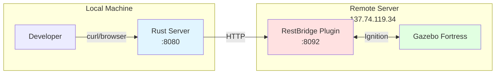
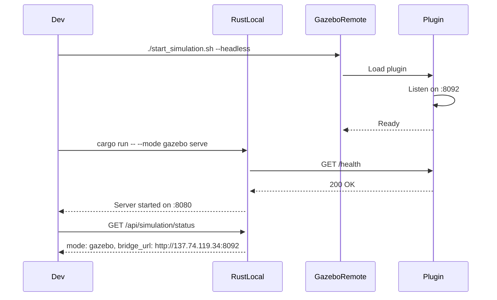
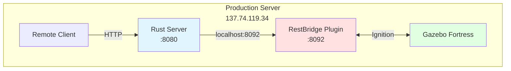
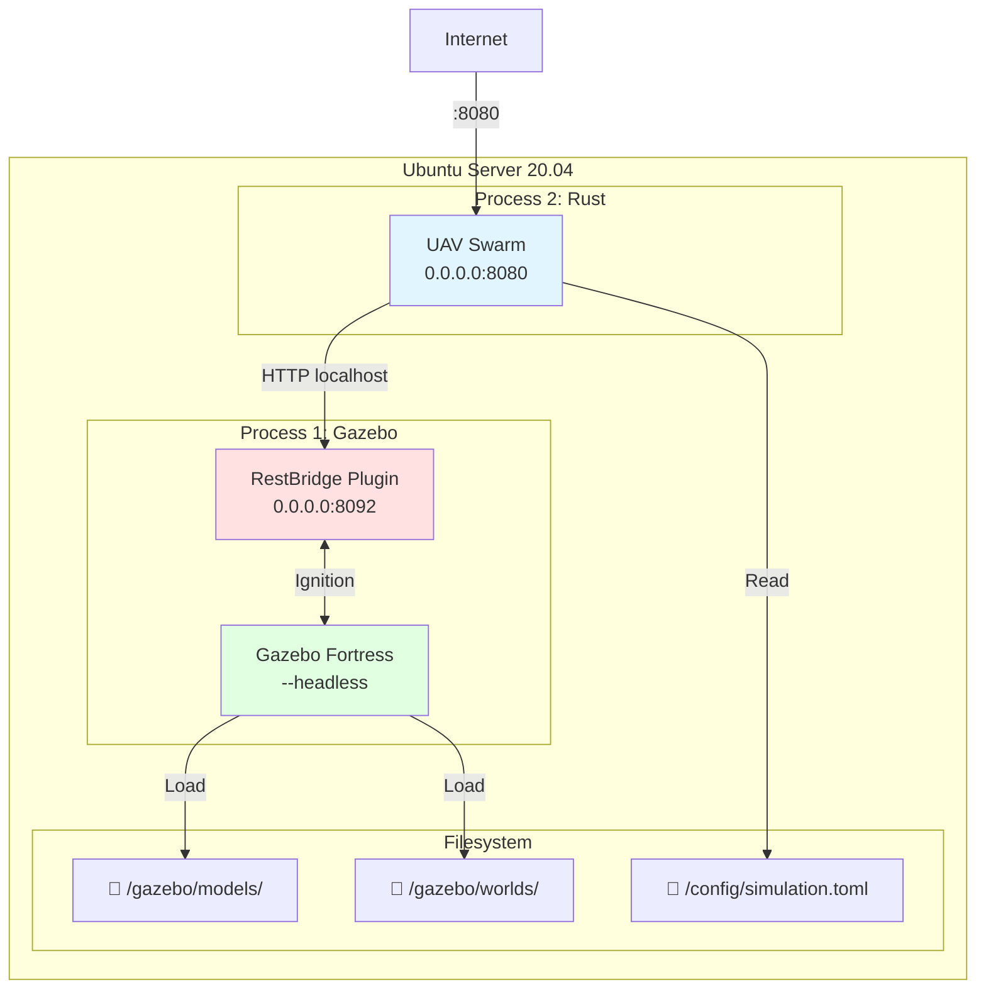
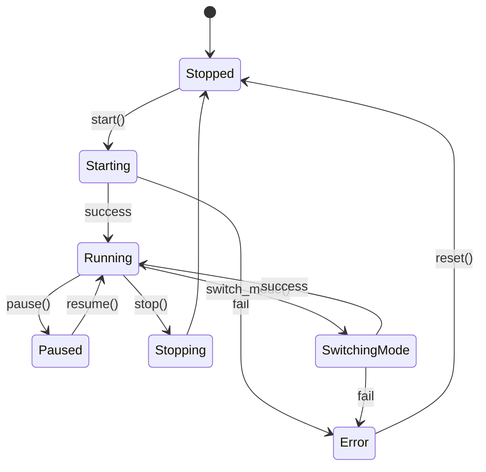

# UAV Swarm - User Guide

Version 1.0 - February 2026

---

## Table of Contents

1. [Introduction](#introduction)
2. [Architecture](#architecture)
3. [Deployment Scenarios](#deployment-scenarios)
4. [Installation](#installation)
5. [Configuration](#configuration)
6. [Usage](#usage)
7. [REST API](#rest-api)
8. [Troubleshooting](#troubleshooting)

---

## Introduction

**UAV Swarm** is a drone swarm control and simulation system developed in Rust. It allows you to:

- 🎮 Control a drone swarm (up to 3 drones by default)
- 🌍 Simulate missions in Gazebo Fortress
- 🔄 Synchronize state between Rust and Gazebo in real-time
- 🌐 Expose a REST API for remote control
- 📊 Manage formations (triangle, line, V-formation)

### Main Components

1. **Rust Server**: Business logic, REST API (port 8080)
2. **Gazebo Server**: 3D physics simulation (port 8092)
3. **RestBridge C++ Plugin**: Communication bridge Rust ↔ Gazebo

---

## Architecture

### System Overview



### Class Diagram (Simplified)



---

## Deployment Scenarios

### Scenario 1: Local Rust + Remote Gazebo

**Use case**: Local development with remote simulation on powerful server



#### Sequence Diagram - Startup



#### Configuration

**On local machine** (`config/simulation.toml`):

```toml
[gazebo]
bridge_url = "http://137.74.119.34:8092"
enabled = true
timeout_ms = 15000
```

**On remote server**:

```bash
cd /home/ubuntu/gazebo
export IGN_GAZEBO_RESOURCE_PATH="/home/ubuntu/gazebo/models"
./launch/start_simulation.sh --headless
```

---

### Scenario 2: Rust + Gazebo on Same Server

**Use case**: Production, unified deployment, minimal latency



#### Deployment Diagram



#### Configuration

**config/simulation.toml**:

```toml
[gazebo]
bridge_url = "http://localhost:8092"  # Same machine
enabled = true
timeout_ms = 5000
```

**Unified startup script** (`deploy/start_all.sh`):

```bash
#!/bin/bash
# Start Gazebo in background
cd /home/ubuntu/gazebo
./launch/start_simulation.sh --headless &
GAZEBO_PID=$!

# Wait for Gazebo to be ready
sleep 5

# Start Rust server
cd /home/ubuntu/uav_in_rust
cargo run --release -- --mode gazebo serve --host 0.0.0.0 &
RUST_PID=$!

echo "Gazebo PID: $GAZEBO_PID"
echo "Rust PID: $RUST_PID"
```

---

## Installation

### Prerequisites

#### Local machine (development)

- **Rust** 1.70+: `curl --proto '=https' --tlsv1.2 -sSf https://sh.rustup.rs | sh`
- **Git**: `brew install git` (macOS) or `apt install git` (Ubuntu)

#### Remote server (simulation)

- **Ubuntu 20.04** or higher
- **Ignition Gazebo Fortress**:
  ```bash
  sudo apt update
  sudo apt install ignition-fortress
  ```
- **Build dependencies**:
  ```bash
  sudo apt install cmake g++ libignition-gazebo7-dev \
    libignition-transport12-dev libignition-math7-dev
  ```

### Project Installation

```bash
# Clone repository
git clone https://github.com/your-org/uav_in_rust.git
cd uav_in_rust

# Build Rust project
cargo build --release

# Build Gazebo plugin (on remote server)
cd gazebo/plugins/rest_bridge
mkdir build && cd build
cmake ..
make
```

---

## Configuration

### Main file: `config/simulation.toml`

```toml
[simulation]
mode = "internal"  # or "gazebo"
update_rate_hz = 10.0

[gazebo]
# Gazebo server URL
# Local: http://localhost:8092
# Remote: http://137.74.119.34:8092
# DNS: http://gazebo_server:8092
bridge_url = "http://gazebo_server:8092"

enabled = true
auto_start = false
timeout_ms = 15000  # Higher for remote connections
```

### Environment variables (optional)

```bash
export UAV_SIMULATION_MODE=gazebo
export UAV_GAZEBO_BRIDGE_URL=http://137.74.119.34:8092
export UAV_GAZEBO_TIMEOUT_MS=15000
```

### Gazebo configuration: `gazebo/worlds/uav_swarm.sdf`

```xml
<plugin filename="libRestBridgePlugin.so"
        name="gazebo_plugins::RestBridgePlugin">
  <rust_api_url>http://localhost:8080</rust_api_url>
  <http_port>8092</http_port>
  <drone>drone_1</drone>
  <drone>drone_2</drone>
  <drone>drone_3</drone>
</plugin>
```

---

## Usage

### Quick Start

#### Local mode (without Gazebo)

```bash
cargo run -- --mode internal serve
```

#### Gazebo mode - Scenario 1 (Local Rust + Remote Gazebo)

**Terminal 1 (on remote server)**:

```bash
ssh ubuntu@137.74.119.34
cd /home/ubuntu/gazebo
./launch/start_simulation.sh --headless
```

**Terminal 2 (on your local machine)**:

```bash
cargo run -- --mode gazebo serve
```

#### Gazebo mode - Scenario 2 (all on server)

**On server**:

```bash
# Terminal 1: Gazebo
./gazebo/launch/start_simulation.sh --headless

# Terminal 2: Rust
cargo run --release -- --mode gazebo serve --host 0.0.0.0
```

### CLI Commands

```bash
# Start with specific mode
cargo run -- --mode internal serve
cargo run -- --mode gazebo serve

# Specify configuration file
cargo run -- --config /path/to/config.toml serve

# Change host and port
cargo run -- serve --host 0.0.0.0 --port 8081
```

### API Testing

```bash
# Check simulation status
curl http://localhost:8080/api/simulation/status

# Expected result
{
  "mode": "gazebo",
  "running": false,
  "engine_connected": true,
  "update_rate_hz": 10.0,
  "bridge_url": "http://137.74.119.34:8092"
}

# Change mode
curl -X POST http://localhost:8080/api/simulation/mode \
  -H "Content-Type: application/json" \
  -d '{"mode": "gazebo"}'

# Get drone state
curl http://localhost:8080/api/drones/drone_1
```

### Complete test script

```bash
# Use provided test script
./test_simulation_api.sh

# Or with remote Gazebo server
GAZEBO_SERVER_URL=http://137.74.119.34:8092 ./test_simulation_api.sh
```

---

## REST API

### Main Endpoints

#### Simulation

| Method | Endpoint | Description |
|--------|----------|-------------|
| GET | `/api/simulation/mode` | Get current mode |
| POST | `/api/simulation/mode` | Change mode (internal/gazebo) |
| GET | `/api/simulation/status` | Detailed simulation status |
| POST | `/api/simulation/start` | Start simulation |
| POST | `/api/simulation/stop` | Stop simulation |

#### Drones

| Method | Endpoint | Description |
|--------|----------|-------------|
| GET | `/api/drones` | List all drones |
| GET | `/api/drones/{id}` | Drone details |
| PUT | `/api/drones/{id}/state` | Update state (from Gazebo) |
| POST | `/api/drones/{id}/command` | Send command |

#### Formations

| Method | Endpoint | Description |
|--------|----------|-------------|
| GET | `/api/formation` | Current formation |
| POST | `/api/formation` | Set formation (triangle/line/v_formation) |

### Swagger Documentation

Access interactive documentation:

```
http://localhost:8080/swagger-ui/
```

---

## Troubleshooting

### Issue: Rust server cannot connect to Gazebo

**Symptom**:

```
Error: Failed to initialize simulation engine
Falling back to internal simulation mode
```

**Solutions**:

1. **Check Gazebo is running**:
   ```bash
   ssh ubuntu@137.74.119.34
   ps aux | grep gazebo
   ```

2. **Test plugin connection**:
   ```bash
   curl http://137.74.119.34:8092/health
   # Expected: {"status": "ok", "sync_enabled": false, ...}
   ```

3. **Check firewall**:
   ```bash
   sudo ufw status
   sudo ufw allow 8092/tcp
   ```

4. **Verify configuration**:
   ```bash
   cat config/simulation.toml | grep bridge_url
   # Must match Gazebo server IP/hostname
   ```

---

### Issue: `bridge_url` is `null` in API

**Cause**: Server is in `internal` mode instead of `gazebo`

**Solution**:

```bash
# Force gazebo mode
curl -X POST http://localhost:8080/api/simulation/mode \
  -H "Content-Type: application/json" \
  -d '{"mode": "gazebo"}'

# Verify
curl http://localhost:8080/api/simulation/status
```

---

### Issue: Drones not found in Gazebo

**Symptom (Gazebo logs)**:

```
[Err] Warning: Drone 'drone_1' not found in world!
```

**Solutions**:

1. **Check models are present**:
   ```bash
   ls /home/ubuntu/gazebo/models/x3_uav/
   ```

2. **Check environment variable**:
   ```bash
   export IGN_GAZEBO_RESOURCE_PATH="/home/ubuntu/gazebo/models"
   ```

3. **Check world file**:
   ```bash
   cat /home/ubuntu/gazebo/worlds/uav_swarm.sdf | grep -A 3 "drone_1"
   ```

4. **Wait for lazy loading**: Plugin searches for drones again during simulation. Wait a few seconds.

---

### Issue: "ApplyLinkWrench should be attached to a world" error

**Solution**: Plugin must be at world level, not model level

Check that in `uav_swarm.sdf`, the plugin is defined as:

```xml
<world name="uav_swarm_world">
  ...
  <plugin
    filename="ignition-gazebo-apply-link-wrench-system"
    name="ignition::gazebo::systems::ApplyLinkWrench">
  </plugin>
  ...
</world>
```

And NOT inside each drone model.

---

### Issue: Port 8080 already in use

**Solution**:

```bash
# Find and kill process
lsof -ti:8080 | xargs kill -9

# Or use another port
cargo run -- serve --port 8081
```

---

## Appendices

### File Architecture

```
uav_in_rust/
├── config/
│   └── simulation.toml          # Main configuration
├── gazebo/
│   ├── launch/
│   │   └── start_simulation.sh  # Gazebo startup script
│   ├── models/
│   │   └── x3_uav/             # Drone model
│   ├── plugins/
│   │   └── rest_bridge/        # RestBridge C++ plugin
│   └── worlds/
│       └── uav_swarm.sdf       # Gazebo world
├── src/
│   ├── api/                    # REST API
│   ├── simulation/             # Simulation engines
│   └── swarm.rs                # Swarm logic
└── doc/
    └── man/                    # Documentation
```

### State Diagram - Simulation



---

## Support

For questions or issues:

- **GitHub Issues**: https://github.com/your-org/uav_in_rust/issues
- **Documentation**: `doc/man/`
- **Gazebo Logs**: `/tmp/gazebo-*.log`
- **Rust Logs**: `RUST_LOG=debug cargo run ...`

---

**Last updated**: February 2026
**Version**: 1.0.0
