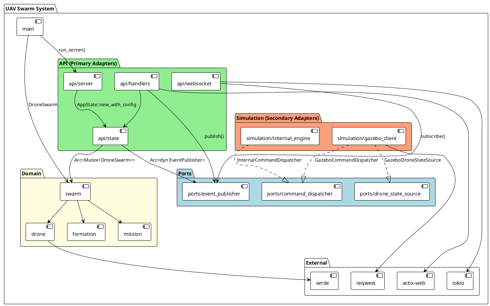
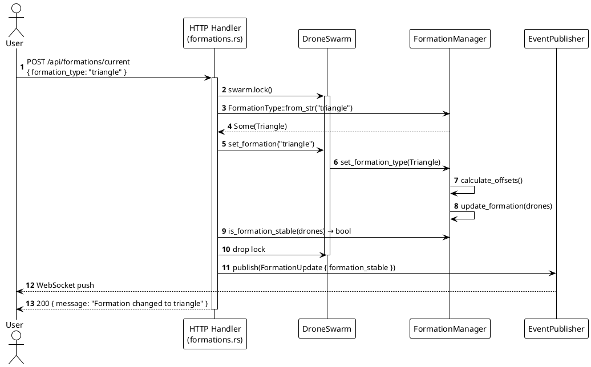
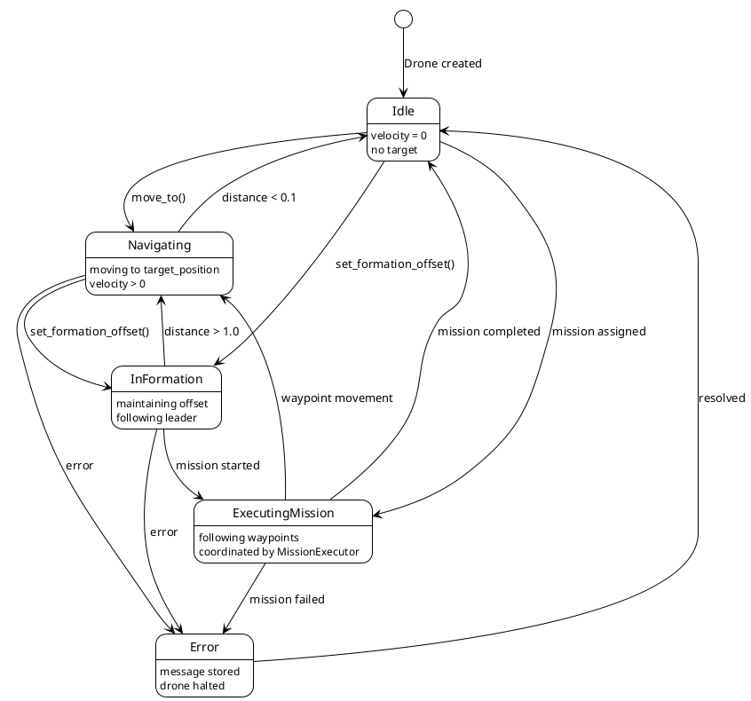

```plantuml
@startuml Hexagonal Architecture
!theme plain
skinparam linetype ortho
skinparam nodesep 60
skinparam ranksep 80

' ─────────────────── DOMAIN (inner hexagon) ───────────────────
package "Domain (src/drone, swarm, formation, mission)" #LightYellow {
  [DroneSwarm] as Swarm
  [FormationManager] as FM
  [MissionExecutor] as ME
  [Drone / Position / Velocity] as D
}

' ─────────────────── PORTS ────────────────────────────────────
package "Ports (src/ports/)" #LightBlue {
  interface CommandDispatcher
  interface EventPublisher
  interface DroneStateSource
}

' ─────────────────── PRIMARY ADAPTERS (driving) ───────────────
package "Primary Adapters — API (src/api/)" #LightGreen {
  [HTTP Handlers\n(drones, formations,\nmissions, swarm)] as Handlers
  [AppState\n(Arc<dyn EventPublisher>)] as State
  [WebSocket Session\n(subscribe)] as WS
}

' ─────────────────── SECONDARY ADAPTERS (driven) ──────────────
package "Secondary Adapters — Simulation (src/simulation/)" #LightSalmon {
  [GazeboCommandDispatcher] as GCD
  [GazeboDroneStateSource] as GDSS
  [InternalCommandDispatcher] as ICD
  [GazeboSimulationEngine /\nInternalSimulationEngine] as Engine
}

package "Secondary Adapters — WebSocket (src/api/websocket/)" #LightSalmon {
  [BroadcastEventPublisher] as BEP
  [NullEventPublisher] as NEP
}

' ─────────────────── WIRING ───────────────────────────────────
Handlers --> State
Handlers --> Swarm : locks Arc<Mutex<DroneSwarm>>
State --> EventPublisher : Arc<dyn EventPublisher>
WS --> EventPublisher : subscribe()

Engine --> DroneStateSource : fetch_states()
Engine --> CommandDispatcher : send_command()

GCD ..|> CommandDispatcher
GDSS ..|> DroneStateSource
ICD ..|> CommandDispatcher
BEP ..|> EventPublisher
NEP ..|> EventPublisher

Swarm *-- FM
Swarm *-- ME
Swarm *-- D

@enduml
```

# UAV Swarm System - Architecture Documentation

**Version:** 0.4.0
**Language:** Rust
**Purpose:** Collaborative UAV (Unmanned Aerial Vehicle) Swarm Controller

---

## Table of Contents

1. [System Overview](#system-overview)
2. [Architecture Principles](#architecture-principles)
3. [Hexagonal Architecture](#hexagonal-architecture)
   - [Vue d'ensemble](#vue-densemble)
   - [Domaine métier (cœur)](#domaine-métier-cœur)
   - [Ports (interfaces)](#ports-interfaces)
   - [Adapters (implémentations)](#adapters-implémentations)
4. [Module Architecture](#module-architecture)
5. [Class Diagram](#class-diagram)
6. [Behavioral Diagrams](#behavioral-diagrams)
   - [Mission Execution Flow](#mission-execution-flow)
   - [Formation Change Flow](#formation-change-flow)
   - [Drone State Machine](#drone-state-machine)
7. [Design Patterns](#design-patterns)
8. [Key Components](#key-components)
9. [Code Navigation](#code-navigation)

---

## System Overview

The UAV Swarm System is a drone coordination platform exposing a REST API and real-time WebSocket feed. It supports two simulation backends (internal physics engine and Gazebo).

### Key Capabilities

- **REST API** (actix-web): full CRUD for drones, formations, missions, swarm
- **Real-time WebSocket**: live drone position/status pushed to clients
- **Formation Control**: Triangle, Line, V-Formation with dynamic reconfiguration
- **Mission Execution**: MoveTo, Patrol, Search with async tick loop
- **Dual Simulation Backend**: internal physics engine or Gazebo via HTTP bridge
- **Hexagonal Architecture**: domain fully decoupled from infrastructure via ports

---

## Architecture Principles

### 1. Ports & Adapters (Hexagonal Architecture)

The architecture strictly separates three layers:

- **Domain** (inner hexagon): business logic, entities, rules — no framework dependency
- **Ports** (`src/ports/`): traits that define what the domain *needs* from the outside world
- **Adapters** (`src/api/`, `src/simulation/`): concrete implementations of ports, wired at startup

This allows swapping any adapter (e.g. replace Gazebo with ROS, replace WebSocket with MQTT) without touching the domain.

### 2. Dependency Rule

```
Adapters → Ports ← Domain
```

Dependencies always point inward. The domain never imports from `api` or `simulation`.

### 3. Async/Await Model

- Tokio runtime throughout
- Non-blocking mission ticks (lock acquired, tick executed, lock released, sleep)
- WebSocket sessions subscribed to a broadcast channel via `EventPublisher`

### 4. Ownership and Borrowing

- `Arc<Mutex<DroneSwarm>>` for shared mutable swarm state across HTTP handlers
- `Arc<dyn Port>` for injected adapters — cloneable, thread-safe
- Compile-time thread-safety guarantees

---

## Hexagonal Architecture

### Vue d'ensemble



### Domaine métier (cœur)

Le cœur du système se trouve dans `src/drone.rs`, `src/swarm.rs`, `src/formation.rs`, `src/mission.rs`. Il ne contient **aucune** référence à actix-web, reqwest, tokio broadcast ou Gazebo. Il s'agit de règles métier pures :

- `DroneSwarm` orchestre la collection de drones, les formations et les missions
- `FormationManager` calcule les offsets géométriques et vérifie la stabilité
- `MissionExecutor` gère le cycle de vie des missions et les waypoints

### Ports (interfaces)

Définis dans `src/ports/`, les ports sont des **traits Rust** que l'infrastructure doit implémenter :

| Port | Fichier | Rôle |
|---|---|---|
| `CommandDispatcher` | `src/ports/command_dispatcher.rs` | Envoyer une commande de déplacement à un drone |
| `EventPublisher` | `src/ports/event_publisher.rs` | Publier un `DroneUpdate` vers les clients WebSocket |
| `DroneStateSource` | `src/ports/drone_state_source.rs` | Récupérer l'état courant des drones depuis un backend |

```rust
// Exemple : le port EventPublisher
pub trait EventPublisher: Send + Sync {
    fn publish(&self, event: DroneUpdate);
    fn subscribe(&self) -> broadcast::Receiver<DroneUpdate>;
}
```

Le domaine ne connaît que les ports — jamais les adapters concrets.

### Adapters (implémentations)

#### Adapters primaires (driving — initialisent l'interaction)

| Adapter | Localisation | Port utilisé |
|---|---|---|
| Handlers HTTP (drones, formations, missions, swarm) | `src/api/handlers/` | `EventPublisher` (via `AppState`) |
| CLI (`main.rs`) | `src/main.rs` | aucun port — crée le swarm directement |

#### Adapters secondaires (driven — appelés par le domaine/engine)

| Adapter | Localisation | Port implémenté |
|---|---|---|
| `GazeboCommandDispatcher` | `src/simulation/gazebo_client.rs` | `CommandDispatcher` |
| `InternalCommandDispatcher` | `src/simulation/internal_engine.rs` | `CommandDispatcher` |
| `GazeboDroneStateSource` | `src/simulation/gazebo_client.rs` | `DroneStateSource` |
| `BroadcastEventPublisher` | `src/api/websocket/publisher.rs` | `EventPublisher` |
| `NullEventPublisher` | `src/api/websocket/publisher.rs` | `EventPublisher` (tests / CLI) |

#### Injection des adapters

L'assemblage se fait au démarrage dans `src/api/state.rs` et `src/api/server.rs` — le domaine ne sait pas quelle implémentation est injectée.

```rust
// AppState — wiring de l'EventPublisher
pub struct AppState {
    pub swarm: Arc<Mutex<DroneSwarm>>,
    pub event_publisher: Arc<dyn EventPublisher>,  // ← port
    pub simulation_config: Arc<SimulationConfig>,
}
```

---

## Module Architecture



### Module Responsibilities

#### `src/main.rs`
- CLI argument parsing (clap)
- Swarm initialization and drone registration
- Routing to `serve`, `status`, `simulate` commands

#### `src/ports/` — interfaces pures
- `command_dispatcher.rs` — `CommandDispatcher` trait
- `event_publisher.rs` — `EventPublisher` trait
- `drone_state_source.rs` — `DroneStateSource` trait + `DroneState` struct

#### `src/api/` — adapter primaire HTTP/WebSocket
- `server.rs` — configure et démarre le serveur actix-web
- `state.rs` — `AppState` partagé entre les handlers (swarm + event_publisher)
- `handlers/` — un fichier par ressource REST (drones, formations, missions, swarm)
- `websocket/` — handler WS, session, messages, `BroadcastEventPublisher`

#### `src/simulation/` — adapters secondaires
- `engine.rs` — trait `SimulationEngine`
- `internal_engine.rs` — moteur physique interne + `InternalCommandDispatcher`
- `gazebo_client.rs` — `GazeboSimulationEngine` + `GazeboCommandDispatcher` + `GazeboDroneStateSource`

#### `src/swarm.rs` — domaine, orchestrateur
- Gère la collection de drones
- Délègue aux `FormationManager` et `MissionExecutor`
- Lance la boucle de simulation

#### `src/drone.rs`, `src/formation.rs`, `src/mission.rs` — domaine pur
- Entités, règles métier, calculs géométriques
- Aucune dépendance vers les couches externes

---

## Class Diagram

```plantuml
@startuml UAV Swarm Class Diagram
!theme plain
skinparam classAttributeIconSize 0
skinparam linetype ortho

' ─── Ports ───
interface CommandDispatcher {
  +send_command(drone_id, target): async Result
}

interface EventPublisher {
  +publish(DroneUpdate)
  +subscribe(): Receiver<DroneUpdate>
}

interface DroneStateSource {
  +fetch_states(): async Result<HashMap<String, DroneState>>
}

interface SimulationEngine {
  +initialize(): async Result
  +update_drones(...): async Result
  +shutdown(): async Result
  +mode(): SimulationMode
  +is_connected(): bool
}

' ─── Adapters ───
class BroadcastEventPublisher {
  -tx: Sender<DroneUpdate>
  +new(capacity): Self
}

class NullEventPublisher {
  +new(): Self
}

class GazeboCommandDispatcher {
  -client: Client
  -bridge_url: String
  +new(bridge_url, timeout_ms): Self
}

class InternalCommandDispatcher {}

class GazeboDroneStateSource {
  -client: Client
  -bridge_url: String
  +new(bridge_url, timeout_ms): Self
}

class GazeboSimulationEngine {
  -client: Client
  -bridge_url: String
  -connected: bool
  -state_source: Box<dyn DroneStateSource>
  +new(bridge_url, timeout_ms): Self
  +new_with_state_source(...): Self
}

class InternalSimulationEngine {
  -drones_last_update: HashMap<String, Instant>
}

' ─── AppState ───
class AppState {
  +swarm: Arc<Mutex<DroneSwarm>>
  +event_publisher: Arc<dyn EventPublisher>
  +simulation_config: Arc<SimulationConfig>
  +new(swarm): Self
  +new_with_config(swarm, config): Self
}

' ─── Domain ───
class DroneSwarm {
  +drones: HashMap<String, Drone>
  +formation_manager: FormationManager
  +mission_executor: MissionExecutor
  +simulation_running: bool
  --
  +add_drone(id, position)
  +set_formation(type): async
  +update_swarm(): async
  +tick_mission_by_id(id): Result<bool>
  +get_swarm_status(): Vec<DroneStatusInfo>
}

class Drone {
  +id: String
  +position: Position
  +velocity: Velocity
  +status: DroneStatus
  +target_position: Option<Position>
  +formation_offset: Option<Position>
  +max_speed: f64
  --
  +move_to(target)
  +update_position(dt)
  +set_formation_offset(offset)
}

class FormationManager {
  +formation_type: FormationType
  +separation_distance: f64
  -formation_offsets: HashMap<String, Position>
  --
  +set_formation_type(FormationType)
  +update_formation(drones)
  +is_formation_stable(drones): bool
}

class MissionExecutor {
  +active_missions: HashMap<String, Mission>
  --
  +create_mission(type, drones): String
  +start_mission(id): Result
  +cancel_mission(id): Result
}

enum DroneUpdate {
  PositionUpdate
  StatusChange
  FormationUpdate
  MissionProgress
}

' ─── Relationships ───
BroadcastEventPublisher ..|> EventPublisher
NullEventPublisher ..|> EventPublisher
GazeboCommandDispatcher ..|> CommandDispatcher
InternalCommandDispatcher ..|> CommandDispatcher
GazeboDroneStateSource ..|> DroneStateSource
GazeboSimulationEngine ..|> SimulationEngine
InternalSimulationEngine ..|> SimulationEngine

GazeboSimulationEngine o-- DroneStateSource : state_source
GazeboSimulationEngine ..> GazeboDroneStateSource : creates

AppState o-- EventPublisher
AppState o-- DroneSwarm

DroneSwarm *-- FormationManager
DroneSwarm *-- MissionExecutor
DroneSwarm o-- Drone

EventPublisher ..> DroneUpdate : publishes

@enduml
```



---

## Behavioral Diagrams

### Mission Execution Flow


### Formation Change Flow



### Drone State Machine



---

## Design Patterns

### 1. Ports & Adapters (Hexagonal Architecture)

**Ports**: `CommandDispatcher`, `EventPublisher`, `DroneStateSource`

Le domaine définit *ce dont il a besoin* via des traits. L'infrastructure fournit les implémentations. Aucun couplage vers actix-web, reqwest ou tokio broadcast dans le domaine.

**Avantages** :
- Testabilité : mock de `DroneStateSource` pour tester le moteur Gazebo
- Extensibilité : nouvel adapter (MQTT, ROS, gRPC) sans toucher le domaine
- Isolation : changer le serveur HTTP n'affecte pas la physique de simulation

### 2. Strategy Pattern

**Implémentation** : `SimulationEngine` (trait), `FormationType` (enum)

- `InternalSimulationEngine` vs `GazeboSimulationEngine` : backends interchangeables
- `Triangle / Line / VFormation` : algorithmes de formation sélectionnables à l'exécution

### 3. Command Pattern

**Implémentation** : `MissionType` enum

```rust
enum MissionType {
    MoveTo(Position),
    Patrol(Vec<Position>),
    Search(Position, f64),
}
```

Les missions sont des objets de première classe, loggables et annulables.

### 4. Observer Pattern

**Implémentation** : `EventPublisher` + `BroadcastEventPublisher`

Les handlers publient des `DroneUpdate` ; les sessions WebSocket s'abonnent via `subscribe()`. Le publisher Tokio broadcast assure la distribution 1-N.

### 5. State Pattern

**Implémentation** : `DroneStatus` enum

Transitions explicites : Idle → Navigating → InFormation → ExecutingMission → Error.

### 6. Orchestrator Pattern

**Implémentation** : `DroneSwarm`

Point d'entrée unique pour la collection de drones. Délègue à `FormationManager` et `MissionExecutor`.

---

## Key Components

### `AppState` (`src/api/state.rs`)

Point d'injection des adapters dans la couche HTTP :

```rust
pub struct AppState {
    pub swarm: Arc<Mutex<DroneSwarm>>,       // domaine partagé
    pub event_publisher: Arc<dyn EventPublisher>,  // port WebSocket
    pub simulation_config: Arc<SimulationConfig>,
}
```

Tous les handlers HTTP reçoivent `web::Data<AppState>`.

### `BroadcastEventPublisher` (`src/api/websocket/publisher.rs`)

Adapter du port `EventPublisher` basé sur `tokio::sync::broadcast` :

- `publish()` : envoie à tous les abonnés, ignore les erreurs (pas d'abonné = OK)
- `subscribe()` : retourne un `Receiver` utilisé par les sessions WebSocket
- `NullEventPublisher` : no-op pour les tests et le mode CLI

### `GazeboDroneStateSource` (`src/simulation/gazebo_client.rs`)

Adapter du port `DroneStateSource` — récupère les états via le bridge HTTP Gazebo :

```rust
async fn fetch_states(&self) -> Result<HashMap<String, DroneState>, String> {
    // GET {bridge_url}/drones/states → HashMap<id, DroneStateUpdate>
    // → map vers DroneState (format du port)
}
```

`GazeboSimulationEngine` l'injecte via `new_with_state_source()` pour les tests.

### `CommandDispatcher` (`src/ports/command_dispatcher.rs`)

Port d'envoi des commandes de déplacement :

- `GazeboCommandDispatcher` : POST vers le bridge HTTP Gazebo
- `InternalCommandDispatcher` : mise à jour directe de `drone.target_position`

---

## Code Navigation

### File Structure

```
src/
├── main.rs                    # CLI + wiring initial
├── drone.rs                   # Entité Drone + Position + Velocity
├── formation.rs               # FormationManager
├── mission.rs                 # Mission + MissionExecutor
├── swarm.rs                   # DroneSwarm (orchestrateur domaine)
│
├── ports/
│   ├── mod.rs
│   ├── command_dispatcher.rs  # Port CommandDispatcher
│   ├── event_publisher.rs     # Port EventPublisher
│   └── drone_state_source.rs  # Port DroneStateSource + DroneState
│
├── api/
│   ├── mod.rs
│   ├── server.rs              # Démarrage actix-web
│   ├── state.rs               # AppState (injection adapters)
│   ├── routes.rs              # Configuration des routes
│   ├── error.rs               # ApiError
│   ├── models.rs              # DTOs request/response
│   ├── handlers/
│   │   ├── drones.rs          # GET/PUT /api/drones
│   │   ├── formations.rs      # GET/POST /api/formations
│   │   ├── missions.rs        # GET/POST /api/missions
│   │   └── swarm.rs           # GET/POST /api/swarm
│   └── websocket/
│       ├── messages.rs        # DroneUpdate enum
│       ├── session.rs         # Handle WS session (subscribe)
│       ├── server.rs          # websocket_handler (actix-ws)
│       └── publisher.rs       # BroadcastEventPublisher + NullEventPublisher
│
└── simulation/
    ├── mod.rs
    ├── engine.rs              # Trait SimulationEngine
    ├── mode.rs                # SimulationMode enum
    ├── config.rs              # SimulationConfig
    ├── internal_engine.rs     # Moteur physique + InternalCommandDispatcher
    └── gazebo_client.rs       # GazeboSimulationEngine + GazeboCommandDispatcher
                               #   + GazeboDroneStateSource
```

### Key Locations

**Ports (interfaces)**:
- `src/ports/command_dispatcher.rs:1` — `CommandDispatcher` trait
- `src/ports/event_publisher.rs:1` — `EventPublisher` trait
- `src/ports/drone_state_source.rs:1` — `DroneStateSource` trait + `DroneState`

**Injection / wiring**:
- `src/api/state.rs:20` — `AppState::new_with_config` crée `BroadcastEventPublisher`
- `src/simulation/gazebo_client.rs` — `GazeboSimulationEngine::new` crée `GazeboDroneStateSource`
- `src/simulation/gazebo_client.rs` — `new_with_state_source()` pour les tests

**Publish d'événements**:
- `src/api/handlers/drones.rs:165` — `event_publisher.publish(PositionUpdate)`
- `src/api/handlers/formations.rs:68` — `event_publisher.publish(FormationUpdate)`
- `src/api/handlers/missions.rs:97` — `event_publisher.publish(MissionProgress)`
- `src/api/handlers/swarm.rs:77` — `event_publisher.publish(PositionUpdate)` (boucle sim)

**Subscribe WebSocket**:
- `src/api/websocket/session.rs:11` — `state.event_publisher.subscribe()`

**Physique domaine**:
- `src/drone.rs:109` — `update_position(dt)` avec delta time
- `src/formation.rs:58` — dispatch des algorithmes de formation
- `src/mission.rs:123` — boucle d'exécution des waypoints

---

## Conclusion

L'architecture hexagonale garantit que le domaine métier (physique des drones, formations, missions) reste **indépendant** de toute infrastructure. Les trois ports extraits — `CommandDispatcher`, `EventPublisher`, `DroneStateSource` — constituent les seules interfaces entre le cœur et le monde extérieur.

**Points forts** :
- Le domaine est testable sans actix-web, sans Gazebo, sans WebSocket
- Chaque adapter peut être remplacé indépendamment (mock en test, Gazebo en production)
- `NullEventPublisher` permet le mode CLI sans broadcast Tokio actif
- `new_with_state_source()` sur le moteur Gazebo permet d'injecter un mock en test d'intégration
- La règle de dépendance est strictement respectée : aucun import de `api` ou `simulation` dans le domaine

---

**Document Version**: 2.0
**Last Updated**: 2026-02-20
**Architecture**: Ports & Adapters (Hexagonal)
