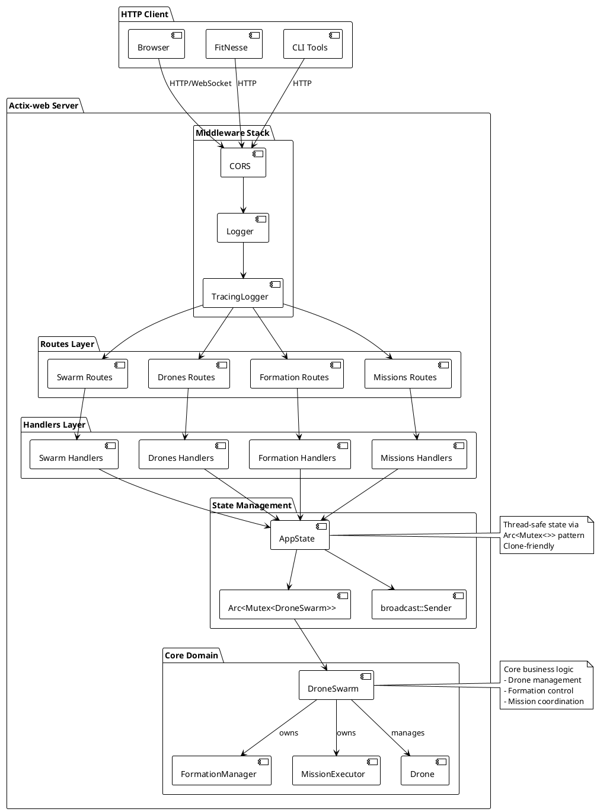
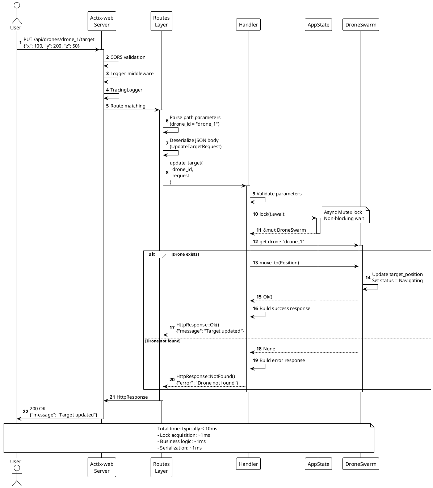

# UAV Swarm API REST - Architecture Documentation

**Version:** 0.1.0
**Framework:** Actix-web (Rust)
**Purpose:** HTTP REST API for UAV Swarm Management and Control

---

## Table of Contents

1. [API Overview](#api-overview)
2. [Architecture Principles](#architecture-principles)
3. [Component Diagram](#component-diagram)
4. [Layered Architecture](#layered-architecture)
5. [API Endpoints](#api-endpoints)
6. [Request/Response Flow](#requestresponse-flow)
7. [Data Models](#data-models)
8. [Error Handling](#error-handling)
9. [WebSocket Communication](#websocket-communication)
10. [Code Navigation](#code-navigation)

---

## API Overview

The UAV Swarm REST API provides an HTTP interface to control and monitor a drone swarm. It exposes endpoints for managing drones, formations, missions, and the overall swarm.

### Core Capabilities

- **Drone Management**: Query individual drones, update targets
- **Formation Control**: List and modify flight formations
- **Mission Execution**: Create, query, and cancel missions
- **Swarm State**: Global swarm monitoring and simulation control
- **Real-time Communication**: WebSocket for live updates
- **Interactive Documentation**: Built-in Swagger UI interface

### Technologies Used

- **Actix-web**: High-performance asynchronous web framework
- **Tokio**: Asynchronous runtime
- **Serde**: JSON serialization/deserialization
- **utoipa**: Automatic OpenAPI documentation generation
- **CORS**: Cross-origin request support
- **Tracing**: Logging and observability

---

## Architecture Principles

### 1. Layered Architecture

The API follows a clear layered architecture:
- **Routes**: HTTP endpoint definitions and mapping to handlers
- **Handlers**: Business logic and orchestration
- **Models**: Data structures for requests/responses
- **State**: Shared state management across requests
- **Error**: Centralized error handling

### 2. Asynchronous Programming

- All handlers are asynchronous (`async fn`)
- Use of asynchronous `Mutex` for state management
- Non-blocking: allows high number of concurrent connections
- Tokio runtime for concurrent execution

### 3. Type Safety

- Type-safe serialization/deserialization with Serde
- Route parameter validation
- Typed errors with `thiserror`
- Automatically generated OpenAPI schemas

### 4. Stateless with Shared State

- Stateless RESTful API
- Shared state via `Arc<Mutex<DroneSwarm>>`
- Thread-safe thanks to Rust's type system
- Broadcast channel for WebSocket

---

## Component Diagram

Component diagram of the API architecture.

<details>
<summary>View PlantUML Source</summary>



</details>

---

## Layered Architecture

### Routes Layer (src/api/routes/)

Defines HTTP endpoints and maps them to appropriate handlers.

**File: `mod.rs`** (src/api/routes/mod.rs:8-18)
- `configure_routes()`: Global route configuration
- Endpoint `/health`: Health check
- Endpoint `/ws/drones`: WebSocket for real-time updates

**File: `swarm.rs`** (src/api/routes/swarm.rs:4-11)
```rust
/api/swarm
  GET    ""        -> get_swarm_status
  POST   "/start"  -> start_simulation
  POST   "/stop"   -> stop_simulation
```

**File: `drones.rs`** (src/api/routes/drones.rs:4-11)
```rust
/api/drones
  GET    ""             -> list_drones
  GET    "/{id}"        -> get_drone_detail
  GET    "/{id}/status" -> get_drone_status
  PUT    "/{id}/target" -> update_target
```

**File: `formations.rs`** (src/api/routes/formations.rs:4-11)
```rust
/api/formations
  GET    ""            -> list_formations
  GET    "/current"    -> get_current_formation
  POST   "/current"    -> set_formation
  PUT    "/separation" -> update_separation
```

**File: `missions.rs`** (src/api/routes/missions.rs:4-12)
```rust
/api/missions
  GET    ""             -> list_missions
  POST   ""             -> create_mission
  GET    "/{id}"        -> get_mission_detail
  GET    "/{id}/status" -> get_mission_status
  DELETE "/{id}"        -> cancel_mission
```

### Handlers Layer (src/api/handlers/)

Contains business logic for each endpoint.

**Responsibilities**:
- Parameter validation
- Shared state access (`AppState`)
- Calls to domain methods (`DroneSwarm`)
- Response construction
- Error handling

**Example: `drones.rs`** (src/api/handlers/drones.rs)

```rust
pub async fn list_drones(state: web::Data<AppState>)
    -> Result<HttpResponse, ApiError>
{
    let swarm = state.swarm.lock().await;
    let drones = swarm.get_swarm_status();
    Ok(HttpResponse::Ok().json(DroneListResponse { drones }))
}
```

**OpenAPI Annotations**:
- `#[utoipa::path(...)]`: Automatic documentation generation
- Specification of possible responses
- Parameter descriptions

### Models Layer (src/api/models/)

Data structures for JSON serialization.

**Model Types**:
- **Request Models**: Structures for request bodies
  - `UpdateTargetRequest`: Target position update
  - Automatic validation by Serde

- **Response Models**: Structures for responses
  - `DroneListResponse`: Drone list
  - `DroneDetailResponse`: Drone details
  - Annotations `#[derive(Serialize, ToSchema)]`

**Example** (src/api/models/drone.rs:5-19):
```rust
#[derive(Debug, Serialize, ToSchema)]
pub struct DroneDetailResponse {
    pub id: String,
    pub position: Position,
    pub velocity: Velocity,
    pub status: DroneStatus,
    pub target_position: Option<Position>,
    pub formation_offset: Option<Position>,
    pub max_speed: f64,
}
```

### State Management (src/api/state.rs)

**AppState** (src/api/state.rs:8-22):
```rust
#[derive(Clone)]
pub struct AppState {
    pub swarm: SharedSwarmState,              // Arc<Mutex<DroneSwarm>>
    pub broadcast_tx: broadcast::Sender<DroneUpdate>,
}
```

**Characteristics**:
- Thread-safe via `Arc` (Atomic Reference Counting)
- Concurrent access via asynchronous `Mutex`
- Lightweight clone thanks to `Arc`
- Broadcast channel for WebSocket

### Error Handling (src/api/error.rs)

**ApiError enum** (src/api/error.rs:5-22):
```rust
pub enum ApiError {
    DroneNotFound(String),
    MissionNotFound(String),
    InvalidFormation(String),
    ValidationError(String),
    Internal(String),
}
```

**`ResponseError` Implementation**:
- Error → HTTP code mapping
- Formatted JSON response generation
- Descriptive error messages

**HTTP Codes**:
- `404 Not Found`: Drone/Mission not found
- `400 Bad Request`: Validation, invalid formation
- `500 Internal Server Error`: Internal errors

---

## API Endpoints

### Health Check

**Endpoint**: `GET /health`

**Description**: API health status check

**Response** (200 OK):
```json
{
  "status": "healthy",
  "service": "uav_swarm_api",
  "version": "0.1.0"
}
```

---

### Swarm Management

#### Get Swarm Status

**Endpoint**: `GET /api/swarm`

**Description**: Gets the global swarm state

**Response** (200 OK):
```json
{
  "drone_count": 3,
  "simulation_running": true,
  "formation_stable": true,
  "current_formation": "Triangle"
}
```

#### Start Simulation

**Endpoint**: `POST /api/swarm/start`

**Description**: Starts the swarm simulation

**Response** (200 OK):
```json
{
  "message": "Simulation started"
}
```

#### Stop Simulation

**Endpoint**: `POST /api/swarm/stop`

**Description**: Stops the swarm simulation

**Response** (200 OK):
```json
{
  "message": "Simulation stopped"
}
```

---

### Drone Operations

#### List Drones

**Endpoint**: `GET /api/drones`

**Description**: Lists all drones in the swarm

**Response** (200 OK):
```json
{
  "drones": [
    {
      "id": "drone_1",
      "position": { "x": 0.0, "y": 0.0, "z": 0.0 },
      "velocity": { "vx": 0.0, "vy": 0.0, "vz": 0.0 },
      "status": "Idle"
    },
    ...
  ]
}
```

#### Get Drone Detail

**Endpoint**: `GET /api/drones/{id}`

**Parameters**:
- `id` (path): Drone identifier

**Response** (200 OK):
```json
{
  "id": "drone_1",
  "position": { "x": 10.5, "y": 20.3, "z": 5.0 },
  "velocity": { "vx": 1.2, "vy": 0.5, "vz": 0.0 },
  "status": "Navigating",
  "target_position": { "x": 50.0, "y": 100.0, "z": 25.0 },
  "formation_offset": null,
  "max_speed": 5.0
}
```

**Errors**:
- `404`: Drone not found

#### Get Drone Status

**Endpoint**: `GET /api/drones/{id}/status`

**Parameters**:
- `id` (path): Drone identifier

**Response** (200 OK):
```json
{
  "id": "drone_1",
  "position": { "x": 10.5, "y": 20.3, "z": 5.0 },
  "velocity": { "vx": 1.2, "vy": 0.5, "vz": 0.0 },
  "status": "InFormation"
}
```

#### Update Drone Target

**Endpoint**: `PUT /api/drones/{id}/target`

**Parameters**:
- `id` (path): Drone identifier

**Request Body**:
```json
{
  "x": 50.0,
  "y": 100.0,
  "z": 25.0
}
```

**Response** (200 OK):
```json
{
  "message": "Target updated for drone drone_1"
}
```

---

### Formation Control

#### List Formations

**Endpoint**: `GET /api/formations`

**Description**: Lists available formation types

**Response** (200 OK):
```json
{
  "formations": ["Triangle", "Line", "VFormation"]
}
```

#### Get Current Formation

**Endpoint**: `GET /api/formations/current`

**Description**: Gets the current formation

**Response** (200 OK):
```json
{
  "formation_type": "Triangle",
  "separation_distance": 10.0,
  "is_stable": true
}
```

#### Set Formation

**Endpoint**: `POST /api/formations/current`

**Description**: Changes the swarm formation

**Request Body**:
```json
{
  "formation_type": "VFormation"
}
```

**Response** (200 OK):
```json
{
  "message": "Formation changed to VFormation"
}
```

**Errors**:
- `400`: Invalid formation type

#### Update Separation Distance

**Endpoint**: `PUT /api/formations/separation`

**Description**: Modifies the separation distance

**Request Body**:
```json
{
  "distance": 15.0
}
```

**Response** (200 OK):
```json
{
  "message": "Separation distance updated"
}
```

---

### Mission Execution

#### List Missions

**Endpoint**: `GET /api/missions`

**Description**: Lists all active missions

**Response** (200 OK):
```json
{
  "missions": [
    {
      "id": "mission_1",
      "mission_type": "MoveTo",
      "status": "InProgress",
      "assigned_drones": ["drone_1", "drone_2", "drone_3"]
    }
  ]
}
```

#### Create Mission

**Endpoint**: `POST /api/missions`

**Description**: Creates a new mission

**Request Body** (MoveTo):
```json
{
  "type": "MoveTo",
  "params": {
    "target": { "x": 100.0, "y": 200.0, "z": 50.0 }
  }
}
```

**Request Body** (Search):
```json
{
  "type": "Search",
  "params": {
    "center": { "x": 0.0, "y": 0.0, "z": 30.0 },
    "radius": 50.0
  }
}
```

**Response** (200 OK):
```json
{
  "id": "mission_2",
  "message": "Mission created successfully"
}
```

#### Get Mission Detail

**Endpoint**: `GET /api/missions/{id}`

**Parameters**:
- `id` (path): Mission identifier

**Response** (200 OK):
```json
{
  "id": "mission_1",
  "mission_type": "MoveTo",
  "status": "InProgress",
  "assigned_drones": ["drone_1", "drone_2", "drone_3"],
  "current_waypoint": 0,
  "total_waypoints": 1
}
```

#### Get Mission Status

**Endpoint**: `GET /api/missions/{id}/status`

**Parameters**:
- `id` (path): Mission identifier

**Response** (200 OK):
```json
{
  "status": "Completed",
  "progress": 100
}
```

#### Cancel Mission

**Endpoint**: `DELETE /api/missions/{id}`

**Parameters**:
- `id` (path): Mission identifier

**Response** (200 OK):
```json
{
  "message": "Mission mission_1 cancelled"
}
```

---

## Request/Response Flow

### Typical HTTP Request Sequence

This diagram illustrates the complete flow of a typical HTTP request through the different API layers.

<details>
<summary>View PlantUML Source</summary>



</details>

### Detailed Steps

1. **Request Reception**: Actix-web receives the HTTP request
2. **Middleware**: Processing by CORS, Logger, TracingLogger
3. **Routing**: URL matching to appropriate handler
4. **Deserialization**: JSON parsing to Rust structures
5. **Validation**: Parameter verification
6. **State Lock**: Acquire lock on DroneSwarm
7. **Business Logic**: Call domain methods
8. **Serialization**: Convert response to JSON
9. **Send**: Return HTTP response to client

---

## Data Models

### Data Model Class Diagram

```plantuml
@startuml API Data Models
!theme plain
skinparam classAttributeIconSize 0

' Core data structures
class Position {
  +x: f64
  +y: f64
  +z: f64
}

class Velocity {
  +vx: f64
  +vy: f64
  +vz: f64
}

enum DroneStatus {
  Idle
  Navigating
  InFormation
  ExecutingMission
  Error(String)
}

' Request models
class UpdateTargetRequest {
  +x: f64
  +y: f64
  +z: f64
}

class SetFormationRequest {
  +formation_type: String
}

class UpdateSeparationRequest {
  +distance: f64
}

class CreateMissionRequest {
  +type: String
  +params: JsonObject
}

' Response models
class DroneListResponse {
  +drones: Vec<DroneStatusInfo>
}

class DroneDetailResponse {
  +id: String
  +position: Position
  +velocity: Velocity
  +status: DroneStatus
  +target_position: Option<Position>
  +formation_offset: Option<Position>
  +max_speed: f64
}

class DroneStatusInfo {
  +id: String
  +position: Position
  +velocity: Velocity
  +status: DroneStatus
}

class SwarmStatusResponse {
  +drone_count: i32
  +simulation_running: bool
  +formation_stable: bool
  +current_formation: String
}

class FormationListResponse {
  +formations: Vec<String>
}

class CurrentFormationResponse {
  +formation_type: String
  +separation_distance: f64
  +is_stable: bool
}

class MissionListResponse {
  +missions: Vec<MissionSummary>
}

class MissionDetailResponse {
  +id: String
  +mission_type: String
  +status: String
  +assigned_drones: Vec<String>
  +current_waypoint: usize
  +total_waypoints: usize
}

class MissionSummary {
  +id: String
  +mission_type: String
  +status: String
  +assigned_drones: Vec<String>
}

class MessageResponse {
  +message: String
}

class CreateMissionResponse {
  +id: String
  +message: String
}

' Error model
class ApiError {
  +error: String
  +status: i32
}

' Relationships
DroneListResponse "1" *-- "*" DroneStatusInfo : contains
DroneDetailResponse "1" *-- "1" Position : has
DroneDetailResponse "1" *-- "1" Velocity : has
DroneDetailResponse "1" *-- "1" DroneStatus : has
DroneStatusInfo "1" *-- "1" Position : has
DroneStatusInfo "1" *-- "1" Velocity : has
DroneStatusInfo "1" *-- "1" DroneStatus : has
UpdateTargetRequest ..> Position : creates

MissionListResponse "1" *-- "*" MissionSummary : contains

note right of UpdateTargetRequest
  Derives: Deserialize, ToSchema
  Used for PUT /api/drones/{id}/target
end note

note right of DroneDetailResponse
  Derives: Serialize, ToSchema
  Used for GET /api/drones/{id}
end note

note bottom of ApiError
  Implements ResponseError
  Converts to HTTP error responses
end note

@enduml
```

<details>
<summary>View PlantUML Source</summary>



</details>

### Position

```rust
pub struct Position {
    pub x: f64,
    pub y: f64,
    pub z: f64,
}
```

Represents a 3D position in space.

### Velocity

```rust
pub struct Velocity {
    pub vx: f64,
    pub vy: f64,
    pub vz: f64,
}
```

Represents a 3D velocity vector.

### DroneStatus

```rust
pub enum DroneStatus {
    Idle,
    Navigating,
    InFormation,
    ExecutingMission,
    Error(String),
}
```

Possible drone states.

### UpdateTargetRequest

```rust
pub struct UpdateTargetRequest {
    pub x: f64,
    pub y: f64,
    pub z: f64,
}
```

Request to update a drone's target position.

### DroneDetailResponse

```rust
pub struct DroneDetailResponse {
    pub id: String,
    pub position: Position,
    pub velocity: Velocity,
    pub status: DroneStatus,
    pub target_position: Option<Position>,
    pub formation_offset: Option<Position>,
    pub max_speed: f64,
}
```

Detailed response for a specific drone.

---

## Error Handling

### Error Structure

All API errors return a formatted JSON:

```json
{
  "error": "Drone not found: invalid_drone",
  "status": 404
}
```

### Error Types

| Error              | HTTP Code | Description                    |
|--------------------|-----------|--------------------------------|
| DroneNotFound      | 404       | Drone not found                |
| MissionNotFound    | 404       | Mission not found              |
| InvalidFormation   | 400       | Invalid formation type         |
| ValidationError    | 400       | Validation error               |
| Internal           | 500       | Internal server error          |

### Implementation

The `ResponseError` trait from Actix-web is implemented to automatically convert errors to appropriate HTTP responses (src/api/error.rs:24-41).

---

## WebSocket Communication

### WebSocket Endpoint

**URL**: `ws://localhost:8080/ws/drones`

**Description**: WebSocket connection to receive real-time drone state updates.

### WebSocket Architecture

**Components** (src/api/websocket/):
- `server.rs`: WebSocket session management
- `session.rs`: Individual client session
- `messages.rs`: Exchanged message types

### Message Flow

```rust
pub struct DroneUpdate {
    pub drone_id: String,
    pub position: Position,
    pub velocity: Velocity,
    pub status: DroneStatus,
}
```

**Operation**:
1. Client connects via WebSocket
2. Server creates a session
3. Session subscribes to broadcast channel
4. Updates are sent in real-time
5. JSON format for messages

### Message Example

```json
{
  "drone_id": "drone_1",
  "position": { "x": 15.2, "y": 23.4, "z": 5.0 },
  "velocity": { "vx": 2.1, "vy": 1.5, "vz": 0.0 },
  "status": "Navigating"
}
```

---

## Code Navigation

### File Structure

```
src/api/
├── mod.rs                  # Main module, exports
├── server.rs               # Server configuration and startup
├── state.rs                # Shared state management AppState
├── error.rs                # Error types and conversions
├── docs.rs                 # OpenAPI/Swagger configuration
├── routes/
│   ├── mod.rs              # Global route configuration
│   ├── swarm.rs            # Routes for /api/swarm
│   ├── drones.rs           # Routes for /api/drones
│   ├── formations.rs       # Routes for /api/formations
│   └── missions.rs         # Routes for /api/missions
├── handlers/
│   ├── mod.rs              # Handler exports
│   ├── swarm.rs            # Swarm handlers
│   ├── drones.rs           # Drone handlers
│   ├── formations.rs       # Formation handlers
│   └── missions.rs         # Mission handlers
├── models/
│   ├── mod.rs              # Model exports
│   ├── drone.rs            # Drone-related models
│   ├── swarm.rs            # Swarm-related models
│   ├── formation.rs        # Formation-related models
│   └── mission.rs          # Mission-related models
└── websocket/
    ├── mod.rs              # WebSocket exports
    ├── server.rs           # WebSocket server
    ├── session.rs          # Session management
    └── messages.rs         # Message types
```

### Key Locations

**Server Initialization**:
- `src/api/server.rs:20-58`: `run_server()` function
- CORS configuration, middleware, routes
- HTTP server startup

**Route Configuration**:
- `src/api/routes/mod.rs:8-18`: Configuration entry point
- Each module defines its own routes

**Main Handlers**:
- `src/api/handlers/drones.rs:15-121`: Drone handlers
- `src/api/handlers/swarm.rs`: Swarm handlers
- OpenAPI annotations for documentation

**Data Models**:
- `src/api/models/drone.rs:5-32`: Request/response structures
- Automatic derivation of `Serialize`, `Deserialize`, `ToSchema`

**State Management**:
- `src/api/state.rs:8-22`: `AppState` structure
- Thread-safe via `Arc<Mutex<>>`

**Error Management**:
- `src/api/error.rs:5-47`: `ApiError` enum and implementation
- Automatic conversion to HTTP responses

---

## Swagger Documentation

### Access to Swagger UI

**URL**: `http://localhost:8080/swagger-ui/`

### Configuration

OpenAPI documentation is automatically generated via `utoipa`:

**File**: `src/api/docs.rs`

```rust
#[derive(OpenApi)]
#[openapi(
    paths(
        // List of annotated handlers
    ),
    components(
        schemas(
            // List of models
        )
    ),
    tags(
        (name = "drones", description = "Drone operations"),
        (name = "swarm", description = "Swarm management"),
        (name = "formations", description = "Formation control"),
        (name = "missions", description = "Mission execution")
    )
)]
pub struct ApiDoc;
```

### OpenAPI Endpoint

**URL**: `http://localhost:8080/api-docs/openapi.json`

Returns the complete OpenAPI 3.0 specification in JSON.

---

## Security and CORS

### CORS Configuration

**Allowed Origins**:
- `http://localhost:*`
- `http://127.0.0.1:*`

**Allowed Methods**:
- GET, POST, PUT, DELETE

**Allowed Headers**:
- Authorization
- Accept
- Content-Type

**Implementation** (src/api/server.rs:30-42):
```rust
let cors = Cors::default()
    .allowed_origin_fn(|origin, _req_head| {
        let origin_str = origin.as_bytes();
        origin_str.starts_with(b"http://localhost")
            || origin_str.starts_with(b"http://127.0.0.1")
    })
    .allowed_methods(vec!["GET", "POST", "PUT", "DELETE"])
    .allowed_headers(vec![
        http::header::AUTHORIZATION,
        http::header::ACCEPT,
        http::header::CONTENT_TYPE,
    ])
    .max_age(3600);
```

---

## Observability and Logging

### Tracing

**Configuration** (src/api/server.rs:10-18):
```rust
pub fn init_tracing() {
    tracing_subscriber::registry()
        .with(
            tracing_subscriber::EnvFilter::try_from_default_env()
                .unwrap_or_else(|_| "uav_swarm=debug,actix_web=info".into()),
        )
        .with(tracing_subscriber::fmt::layer())
        .init();
}
```

### Default Log Levels

- `uav_swarm`: DEBUG
- `actix_web`: INFO

### Logging Middleware

- **Logger**: Actix-web standard HTTP logs
- **TracingLogger**: Integration with tracing system

### Environment Variables

Configure log level via `RUST_LOG`:
```bash
RUST_LOG=debug cargo run -- serve --port 8080
```

---

## Performance and Scalability

### Characteristics

**Asynchronous**:
- Tokio runtime for non-blocking I/O
- Asynchronous handlers
- No threads blocked waiting

**Actix-web**:
- Actor-based architecture
- Efficient handling of thousands of connections
- Configurable thread pool

**State Management**:
- `Arc`: Atomic reference counting
- Async `Mutex`: Non-blocking lock
- Lightweight shared state cloning

### Current Limitations

**Global Shared State**:
- Single `DroneSwarm` for all clients
- Global lock can be a bottleneck
- No sharding or partitioning

**Possible Improvements**:
- Read-through cache for GET requests
- Read/write separation with RwLock
- Batch processing for updates
- Metrics and monitoring

---

## Server Startup

### Command

```bash
cargo run -- serve --host 127.0.0.1 --port 8080
```

### Parameters

- `--host`: Listen address (default: 127.0.0.1)
- `--port`: Listen port (default: 8080)

### Manual Testing

**Health check**:
```bash
curl http://localhost:8080/health
```

**List drones**:
```bash
curl http://localhost:8080/api/drones
```

**Swagger Documentation**:
Open in browser: `http://localhost:8080/swagger-ui/`

---

## Domain Integration

The REST API is a thin layer on top of existing business logic:

```
┌─────────────────────────────────┐
│      API REST (Actix-web)       │
│  - Routes                       │
│  - Handlers                     │
│  - JSON Serialization           │
└────────────┬────────────────────┘
             │
             │ Direct calls
             │
             ▼
┌─────────────────────────────────┐
│     Domain Layer (Core)         │
│  - DroneSwarm                   │
│  - FormationManager             │
│  - MissionExecutor              │
│  - Drone                        │
└─────────────────────────────────┘
```

**Separation Principle**:
- API contains no business logic
- All logic is in the domain
- API does request/response mapping
- Facilitates unit testing

---

## Conclusion

The UAV Swarm REST API architecture demonstrates a clear separation of responsibilities with:

**Strengths**:
- Well-defined layered architecture
- Type safety thanks to Rust and Serde
- Automatic documentation via OpenAPI
- Robust error handling
- WebSocket for real-time
- High performance with Actix-web

**Applied Principles**:
- RESTful design
- Stateless API
- Non-blocking asynchronous
- Thread-safe by construction
- Documentation as code

This architecture provides a solid foundation to expose drone swarm capabilities via HTTP, while maintaining flexibility for future evolution.

---

**Document Version**: 1.0
**Last Updated**: 2026-01-20
**Maintainer**: Development Team
