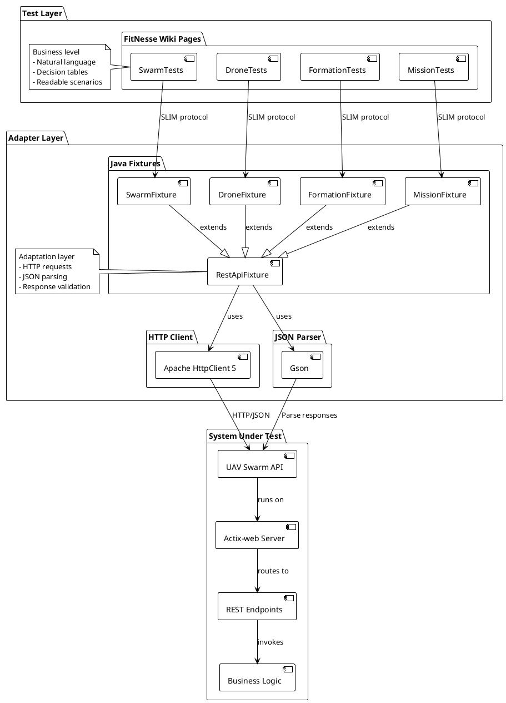
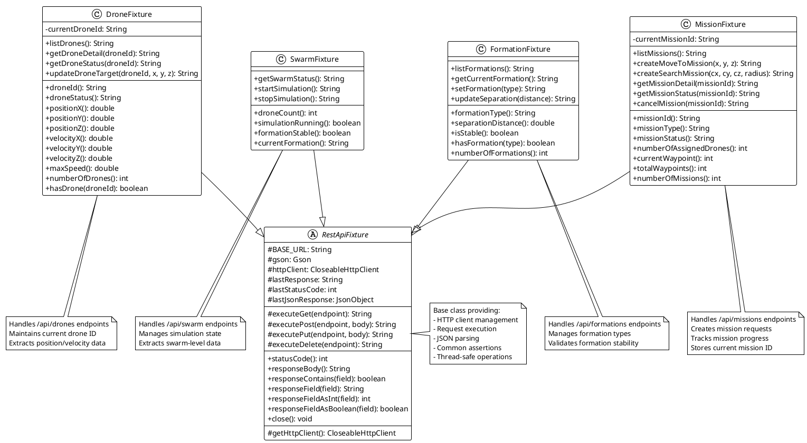
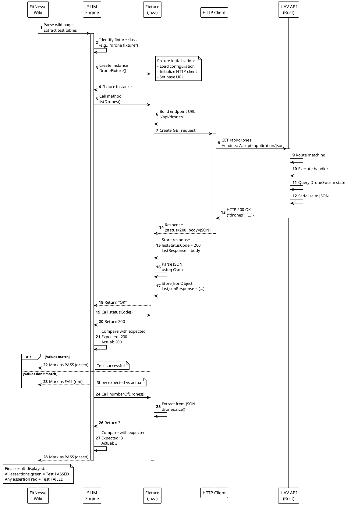

# UAV Swarm FitNesse Tests - Architecture Documentation

**Version:** 0.1.0
**Framework:** FitNesse with SLIM
**Purpose:** Acceptance Testing for UAV Swarm REST API

---

## Table of Contents

1. [Tests Overview](#tests-overview)
2. [Architecture Principles](#architecture-principles)
3. [FitNesse Architecture](#fitnesse-architecture)
4. [Fixtures Architecture](#fixtures-architecture)
5. [Test Organization](#test-organization)
6. [Test Scenarios](#test-scenarios)
7. [Communication Flow](#communication-flow)
8. [Fixture Details](#fixture-details)
9. [Test Execution](#test-execution)
10. [Code Navigation](#code-navigation)

---

## Tests Overview

The FitNesse test suite provides automated acceptance testing for the UAV Swarm REST API. It enables validation of API behavior in a readable and maintainable way.

### Core Capabilities

- **Acceptance Testing**: Business behavior validation via HTTP
- **Functional Testing**: Verification of each API endpoint
- **Integration Testing**: Validation of complete flows (create → execute → verify)
- **Living Documentation**: Tests serve as executable documentation
- **Readability**: Tabular format understandable by all stakeholders

### Technologies Used

- **FitNesse**: Wiki-based acceptance testing framework
- **SLIM**: Simple List Invocation Method (execution engine)
- **Java Fixtures**: Adapters between FitNesse and REST API
- **Apache HTTP Client 5**: HTTP communication
- **Gson**: JSON parsing and manipulation
- **Maven**: Dependency and build management

---

## Architecture Principles

### 1. Separation of Concerns

FitNesse tests follow a three-layer architecture.


<details>
<summary>View PlantUML Source</summary>



</details>

### 2. Test Readability

**Tabular Format**:
- Columns represent actions and assertions
- Rows represent test steps
- Readable by non-developers (PO, QA, etc.)

**Example**:
```
|script|drone fixture             |
|list drones                      |
|check|status code         |200  |
|check|number of drones    |3    |
```

### 3. Fixture Pattern

Each fixture inherits from `RestApiFixture` and provides:
- **Business Methods**: Intuitive API for tests
- **HTTP Management**: Transparent REST calls
- **JSON Parsing**: Automatic data extraction
- **State Management**: Context preservation between calls

### 4. Data-Driven Testing

Tests are parameterizable:
- Positions (x, y, z)
- Drone identifiers
- Formation types
- Mission parameters

---

## FitNesse Architecture

### Wiki Structure

FitNesse uses a wiki structure to organize tests:

```
FitNesseRoot/
├── FrontPage/              # Home page
├── UavSwarmApi/            # Main test suite
│   ├── content.txt         # Description and configuration
│   ├── SwarmTests/         # Swarm tests
│   ├── DroneTests/         # Drone tests
│   ├── FormationTests/     # Formation tests
│   └── MissionTests/       # Mission tests
```

### Suite Configuration

**File**: `UavSwarmApi/content.txt` (lines 3-8)

```
!define FITNESSE_ROOT_PATH {../../../fitnesse}
!define TEST_SYSTEM {slim}
!path ${FITNESSE_ROOT_PATH}/fixtures/target/fitnesse-fixtures-1.0.0-jar-with-dependencies.jar
```

**Configuration Elements**:
- `TEST_SYSTEM`: Use of SLIM engine
- `!path`: Classpath to fixtures JAR
- Enables Java test execution

### SLIM Protocol

**Simple List Invocation Method**:
1. FitNesse sends commands in list format
2. SLIM server executes Java methods
3. Results are returned and compared
4. Visual update (green/red) in the wiki

---

## Fixtures Architecture

### Fixture Hierarchy

Class diagram showing the hierarchy and responsibilities of test fixtures.


<details>
<summary>View PlantUML Source</summary>



</details>

### RestApiFixture (Base Class)

**File**: `fitnesse/fixtures/src/main/java/uav/fixtures/RestApiFixture.java`

**Responsibilities**:
- API base URL configuration
- HTTP client management (Apache HttpClient 5)
- HTTP request execution (GET, POST, PUT, DELETE)
- JSON response parsing with Gson
- Storage of last response and status code
- Utility methods to extract JSON fields

**Key Members** (lines 18-24):
```java
protected static final String BASE_URL = System.getProperty("api.base.url", "http://localhost:8080");
protected final Gson gson = new Gson();
protected CloseableHttpClient httpClient;
protected String lastResponse;
protected int lastStatusCode;
protected JsonObject lastJsonResponse;
```

**HTTP Methods** (lines 46-143):

**GET Request** (lines 46-64):
```java
protected String executeGet(String endpoint) throws IOException {
    HttpGet request = new HttpGet(BASE_URL + endpoint);
    request.setHeader("Accept", "application/json");

    getHttpClient().execute(request, response -> {
        lastStatusCode = response.getCode();
        lastResponse = EntityUtils.toString(response.getEntity());

        if (lastResponse != null && !lastResponse.isEmpty()) {
            try {
                lastJsonResponse = gson.fromJson(lastResponse, JsonObject.class);
            } catch (Exception e) {
                lastJsonResponse = null;
            }
        }
        return null;
    });
    return "OK";
}
```

**POST Request** (lines 69-92): Similar with JSON body
**PUT Request** (lines 97-120): Similar with JSON body
**DELETE Request** (lines 125-143): Similar to GET

**Assertion Methods** (lines 148-200):
- `statusCode()`: Returns HTTP code
- `responseBody()`: Returns raw body
- `responseContains(field)`: Checks field presence
- `responseField(field)`: Extracts a string value
- `responseFieldAsInt(field)`: Extracts an integer
- `responseFieldAsBoolean(field)`: Extracts a boolean

### DroneFixture

**File**: `fitnesse/fixtures/src/main/java/uav/fixtures/DroneFixture.java`

**Responsibilities**:
- Testing `/api/drones` endpoints
- Managing drone details and status
- Updating target positions

**Main Methods** (lines 22-70):

**List drones** (lines 22-28):
```java
public String listDrones() {
    try {
        return executeGet("/api/drones");
    } catch (Exception e) {
        throw new RuntimeException("Failed to list drones: " + e.getMessage(), e);
    }
}
```

**Drone details** (lines 33-40):
```java
public String getDroneDetail(String droneId) {
    try {
        this.currentDroneId = droneId;
        return executeGet("/api/drones/" + droneId);
    } catch (Exception e) {
        throw new RuntimeException("Failed to get drone detail: " + e.getMessage(), e);
    }
}
```

**Update target** (lines 57-70):
```java
public String updateDroneTarget(String droneId, double x, double y, double z) {
    try {
        this.currentDroneId = droneId;

        JsonObject target = new JsonObject();
        target.addProperty("x", x);
        target.addProperty("y", y);
        target.addProperty("z", z);

        return executePut("/api/drones/" + droneId + "/target", gson.toJson(target));
    } catch (Exception e) {
        throw new RuntimeException("Failed to update drone target: " + e.getMessage(), e);
    }
}
```

**Response Accessors** (lines 75-134):
- `droneId()`: Drone ID
- `droneStatus()`: Drone status
- `positionX()`, `positionY()`, `positionZ()`: Coordinates
- `maxSpeed()`: Maximum speed
- `numberOfDrones()`: Number of drones in list

### SwarmFixture

**File**: `fitnesse/fixtures/src/main/java/uav/fixtures/SwarmFixture.java`

**Responsibilities**:
- Testing `/api/swarm` endpoints
- Simulation control
- Global state verification

**Main Methods** (lines 18-46):

```java
public String getSwarmStatus() {
    return executeGet("/api/swarm");
}

public String startSimulation() {
    return executePost("/api/swarm/start", "{}");
}

public String stopSimulation() {
    return executePost("/api/swarm/stop", "{}");
}
```

**Accessors** (lines 51-75):
- `droneCount()`: Number of drones
- `simulationRunning()`: Simulation state
- `formationStable()`: Formation stability

### FormationFixture

**Responsibilities**:
- Testing `/api/formations` endpoints
- Managing formation types
- Updating separation distance

**Main Methods**:
- `listFormations()`: List available formations
- `getCurrentFormation()`: Current formation
- `setFormation(type)`: Formation change
- `updateSeparation(distance)`: Separation update

### MissionFixture

**File**: `fitnesse/fixtures/src/main/java/uav/fixtures/MissionFixture.java`

**Responsibilities**:
- Testing `/api/missions` endpoints
- Creating missions (MoveTo, Search)
- Tracking and canceling missions

**Create MoveTo Mission** (lines 34-58):
```java
public String createMoveToMission(double x, double y, double z) {
    try {
        JsonObject target = new JsonObject();
        target.addProperty("x", x);
        target.addProperty("y", y);
        target.addProperty("z", z);

        JsonObject params = new JsonObject();
        params.add("target", target);

        JsonObject mission = new JsonObject();
        mission.addProperty("type", "MoveTo");
        mission.add("params", params);

        String result = executePost("/api/missions", gson.toJson(mission));

        // Store mission ID from response
        if (lastJsonResponse != null && lastJsonResponse.has("id")) {
            currentMissionId = lastJsonResponse.get("id").getAsString();
        }
        return result;
    } catch (Exception e) {
        throw new RuntimeException("Failed to create MoveTo mission: " + e.getMessage(), e);
    }
}
```

**Create Search Mission** (lines 63-87):
Similar but with center and radius.

**Accessors** (lines 128-191):
- `missionId()`: Mission ID
- `missionType()`: Mission type
- `missionStatus()`: Status
- `numberOfAssignedDrones()`: Assigned drones
- `currentWaypoint()`, `totalWaypoints()`: Progress

---

## Test Organization

### Test Suite Structure

```
UavSwarmApi/                    # Main suite
├── content.txt                 # Configuration and index
├── SwarmTests/                 # Swarm tests
│   └── content.txt             # Tests: status, start, stop
├── DroneTests/                 # Drone tests
│   └── content.txt             # Tests: list, detail, status, target
├── FormationTests/             # Formation tests
│   └── content.txt             # Tests: list, current, set, separation
└── MissionTests/               # Mission tests
    └── content.txt             # Tests: create, detail, status, cancel
```

### DroneTests

**File**: `fitnesse/FitNesseRoot/UavSwarmApi/DroneTests/content.txt`

**Test Scenarios**:

1. **List All Drones** (lines 12-17)
   - Call: `list drones`
   - Verifications: code 200, number of drones = 3

2. **Get Specific Drone Details** (lines 19-28)
   - Call: `get drone detail` with ID
   - Verifications: code 200, presence of position, velocity, status

3. **Get Drone Status** (lines 30-37)
   - Call: `get drone status` with ID
   - Verifications: code 200, response structure

4. **Update Drone Target Position** (lines 39-44)
   - Call: `update drone target` with coordinates
   - Verifications: code 200, confirmation message

5. **Verify All Drones Exist** (lines 46-54)
   - Multiple calls: get detail for each drone
   - Verifications: all return 200

6. **Invalid Drone ID Returns 404** (lines 56-60)
   - Call: get detail with invalid ID
   - Verifications: code 404

7. **Multiple Target Updates** (lines 62-70)
   - Successive calls: update target
   - Verifications: each update succeeds (200)

### SLIM Test Format

**Script Table**:
```
|script|fixture class name              |
|method call                            |
|check |method call          |expected  |
```

**Concrete Example**:
```
|script|drone fixture                  |
|get drone detail       |drone_1      |
|check|status code            |200   |
|check|drone id               |drone_1|
|check|response contains|position    |true|
```

**Interpretation**:
1. Instantiate `DroneFixture`
2. Call `getDroneDetail("drone_1")`
3. Call `statusCode()` and compare with "200"
4. Call `droneId()` and compare with "drone_1"
5. Call `responseContains("position")` and compare with "true"

---

## Test Scenarios

### Complete Scenario: Mission Creation and Execution

**Test Sequence**:

```
|script|mission fixture                              |
|create move to mission;      |100|200|50          |  ← Create mission
|check|status code                       |200      |
|check|response contains|id              |true     |
|$missionId=                   |mission id|        |  ← Store ID

|get mission detail            |$missionId         |  ← Query details
|check|status code                       |200      |
|check|mission type                      |MoveTo   |
|check|number of assigned drones         |3        |

|get mission status            |$missionId         |  ← Track progress
|check|status code                       |200      |
|check|mission status                    |InProgress|

|cancel mission                |$missionId         |  ← Cancel mission
|check|status code                       |200      |
```

### Scenario: Formation Change

```
|script|formation fixture                 |
|list formations                          |
|check|status code              |200     |

|get current formation                    |
|check|status code              |200     |
|$currentFormation=            |formation type|

|set formation                 |VFormation |
|check|status code              |200     |

|get current formation                    |
|check|formation type           |VFormation|
```

### Scenario: Drone Monitoring

```
|script|drone fixture                     |
|list drones                              |
|check|status code              |200     |
|check|number of drones         |3       |

|get drone detail              |drone_1  |
|check|status code              |200     |
|$x=                           |position x|
|$y=                           |position y|
|$z=                           |position z|

|update drone target;          |drone_1|100|200|50|
|check|status code              |200     |

|get drone status              |drone_1  |
|check|status code              |200     |
|check|drone status             |Navigating|
```

---

## Communication Flow

### Complete Test Flow

Detailed sequence of FitNesse test execution from wiki page to result validation.


<details>
<summary>View PlantUML Source</summary>



</details>

### Step Details

1. **Parse test**: FitNesse reads wiki page and identifies test tables
2. **Create fixture**: SLIM instantiates Java fixture class
3. **Call method**: SLIM calls methods specified in test
4. **HTTP Request**: Fixture sends HTTP request to API
5. **Process request**: API processes request and generates response
6. **JSON Response**: API returns JSON response
7. **Parse JSON**: Fixture parses JSON and stores values
8. **Return value**: Fixture returns value to SLIM
9. **Compare result**: SLIM compares with expected value
10. **Display**: FitNesse displays result (green = success, red = failure)

---

## Fixture Details

### HTTP Client Management

**Lazy initialization** (RestApiFixture.java:36-41):
```java
protected CloseableHttpClient getHttpClient() {
    if (httpClient == null) {
        httpClient = HttpClients.createDefault();
    }
    return httpClient;
}
```

**Cleanup** (lines 212-220):
```java
public void close() {
    try {
        if (httpClient != null) {
            httpClient.close();
        }
    } catch (IOException e) {
        // Ignore
    }
}
```

### JSON Parsing

**Automatic Extraction** (executeGet example, lines 54-60):
```java
if (lastResponse != null && !lastResponse.isEmpty()) {
    try {
        lastJsonResponse = gson.fromJson(lastResponse, JsonObject.class);
    } catch (Exception e) {
        lastJsonResponse = null;
    }
}
```

**Typed Accessors** (lines 185-200):
```java
public int responseFieldAsInt(String fieldName) {
    if (lastJsonResponse == null || !lastJsonResponse.has(fieldName)) {
        return -1;
    }
    return lastJsonResponse.get(fieldName).getAsInt();
}

public boolean responseFieldAsBoolean(String fieldName) {
    if (lastJsonResponse == null || !lastJsonResponse.has(fieldName)) {
        return false;
    }
    return lastJsonResponse.get(fieldName).getAsBoolean();
}
```

### JSON Request Construction

**Example: MissionFixture** (lines 60-68):
```java
JsonObject center = new JsonObject();
center.addProperty("x", centerX);
center.addProperty("y", centerY);
center.addProperty("z", centerZ);

JsonObject params = new JsonObject();
params.add("center", center);
params.addProperty("radius", radius);

JsonObject mission = new JsonObject();
mission.addProperty("type", "Search");
mission.add("params", params);
```

Generates:
```json
{
  "type": "Search",
  "params": {
    "center": { "x": 0.0, "y": 0.0, "z": 30.0 },
    "radius": 50.0
  }
}
```

---

## Test Execution

### Prerequisites

**Start the API**:
```bash
cd /path/to/uav_in_rust
cargo run -- serve --port 8080
```

**Build the fixtures**:
```bash
cd fitnesse/fixtures
mvn clean package
```

### Start FitNesse

**Via script**:
```bash
cd fitnesse
./run-fitnesse.sh
```

**Manually**:
```bash
cd fitnesse
java -jar fitnesse-20251025-standalone.jar -p 8081
```

**Access**: `http://localhost:8081`

### Execute Tests

**Via web interface**:
1. Navigate to `http://localhost:8081/UavSwarmApi`
2. Click "Suite" to run all tests
3. Or navigate to a specific test and click "Test"

**Via command line**:
```bash
cd fitnesse
java -jar fitnesse-20251025-standalone.jar -c "UavSwarmApi?suite&format=text"
```

### API URL Configuration

**Default value**: `http://localhost:8080`

**Override**:
```bash
java -Dapi.base.url=http://192.168.1.100:8080 -jar fitnesse-*.jar
```

### CI/CD Integration

**In Jenkins/GitLab CI**:
```yaml
test:
  script:
    # Start API in background
    - cargo build --release
    - cargo run --release -- serve --port 8080 &
    - API_PID=$!

    # Wait for API to be ready
    - sleep 5

    # Build and execute FitNesse tests
    - cd fitnesse/fixtures
    - mvn clean package
    - cd ..
    - java -jar fitnesse-*.jar -c "UavSwarmApi?suite&format=text"

    # Cleanup
    - kill $API_PID
```

---

## Code Navigation

### File Structure

```
fitnesse/
├── fitnesse-*.jar                  # FitNesse standalone server
├── run-fitnesse.sh                 # Startup script
├── pom.xml                         # Maven configuration for fixtures
├── FitNesseRoot/                   # Wiki content
│   └── UavSwarmApi/                # Main test suite
│       ├── content.txt             # Suite configuration
│       ├── SwarmTests/
│       │   ├── content.txt         # Swarm tests
│       │   └── properties.xml      # Metadata
│       ├── DroneTests/
│       │   ├── content.txt         # Drone tests
│       │   └── properties.xml
│       ├── FormationTests/
│       │   ├── content.txt         # Formation tests
│       │   └── properties.xml
│       └── MissionTests/
│           ├── content.txt         # Mission tests
│           └── properties.xml
└── fixtures/                       # Java fixture code
    ├── pom.xml                     # Maven configuration
    └── src/main/java/uav/fixtures/
        ├── RestApiFixture.java     # Base fixture
        ├── DroneFixture.java       # Drone fixture
        ├── SwarmFixture.java       # Swarm fixture
        ├── FormationFixture.java   # Formation fixture
        └── MissionFixture.java     # Mission fixture
```

### Key Locations

**Suite Configuration**:
- `fitnesse/FitNesseRoot/UavSwarmApi/content.txt`: Global configuration

**Base Fixtures**:
- `fitnesse/fixtures/src/main/java/uav/fixtures/RestApiFixture.java`: Parent class

**Drone Tests**:
- `fitnesse/FitNesseRoot/UavSwarmApi/DroneTests/content.txt`: Test page
- `fitnesse/fixtures/src/main/java/uav/fixtures/DroneFixture.java`: Fixture

**Mission Tests**:
- `fitnesse/FitNesseRoot/UavSwarmApi/MissionTests/content.txt`: Test page
- `fitnesse/fixtures/src/main/java/uav/fixtures/MissionFixture.java`: Fixture

**Build**:
- `fitnesse/fixtures/pom.xml`: Maven dependencies
- Target: `fitnesse/fixtures/target/fitnesse-fixtures-1.0.0-jar-with-dependencies.jar`

---

## Best Practices

### Writing Tests

**1. One test, one responsibility**:
```
!2 Test 1: List All Drones

|script|drone fixture             |
|list drones                      |
|check|status code         |200  |
|check|number of drones    |3    |
```

**2. Descriptive names**:
- Use clear titles (`!2 Test X: Description`)
- Explicitly name scenarios

**3. Explicit assertions**:
- Verify HTTP code
- Verify response structure
- Verify expected values

**4. Test isolation**:
- Each test must be independent
- Don't depend on execution order
- Clean up state if necessary

### Fixture Development

**1. Inherit from RestApiFixture**:
```java
public class MyFixture extends RestApiFixture {
    // Inherits all HTTP and JSON capabilities
}
```

**2. Clear business methods**:
```java
public String createMission(double x, double y, double z) {
    // Not createMoveToMissionWithCoordinates
}
```

**3. Error handling**:
```java
try {
    return executeGet("/api/endpoint");
} catch (Exception e) {
    throw new RuntimeException("Failed to ...: " + e.getMessage(), e);
}
```

**4. Context preservation**:
```java
private String currentMissionId;

public String createMission(...) {
    // ...
    if (lastJsonResponse != null && lastJsonResponse.has("id")) {
        currentMissionId = lastJsonResponse.get("id").getAsString();
    }
    // ...
}
```

### Test Organization

**1. Structure by domain**:
- SwarmTests: Swarm tests
- DroneTests: Drone tests
- FormationTests: Formation tests
- MissionTests: Mission tests

**2. Positive and negative tests**:
```
!2 Test 5: Verify All Drones Exist (positive)
!2 Test 6: Invalid Drone ID Returns 404 (negative)
```

**3. Complete flow tests**:
- Create → Query → Update → Delete
- Integration of multiple domains

---

## Architecture Benefits

### Living Documentation

- Tests serve as executable specification
- Always up-to-date (otherwise they fail)
- Readable by all stakeholders
- Easily modifiable wiki format

### Decoupling

- Tests independent of implementation
- Communication via standard HTTP/JSON
- Can test any REST API
- Easy to change API language

### Maintainability

- Clear fixture hierarchy
- Shared code in RestApiFixture
- Easy addition of new tests
- Simple fixture modification

### Quality

- Automated behavior validation
- Rapid regression detection
- Acceptance testing before delivery
- CI/CD integration

---

## Future Improvements

### Possible Extensions

**1. Performance tests**:
- Response time measurement
- Load testing via FitNesse

**2. Concurrency tests**:
- Simultaneous requests
- Thread-safety validation

**3. Resilience tests**:
- Behavior on network errors
- Timeout and retry

**4. Security tests**:
- Input validation
- Injection tests
- CORS and headers

**5. Advanced fixtures**:
- WebSocketFixture for real-time
- JSON schema validation
- Complex structure comparison

**6. Enhanced reporting**:
- Allure integration
- Trend graphs
- Coverage metrics

---

## Conclusion

The FitNesse test architecture for the UAV Swarm API demonstrates a structured and maintainable approach to acceptance testing:

**Strengths**:
- Clear separation between tests (wiki) and code (fixtures)
- Reusable fixture hierarchy
- Decoupled HTTP/JSON communication
- Readable tests for non-developers
- Easy CI/CD integration

**Applied Principles**:
- Fixture pattern for adaptation
- Inheritance for reusability
- State management for context
- Tabular format for readability
- Data-driven testing

This architecture provides a solid foundation to validate REST API behavior automatically, while serving as living documentation of the system.

---

**Document Version**: 1.0
**Last Updated**: 2026-01-20
**Maintainer**: Development Team
